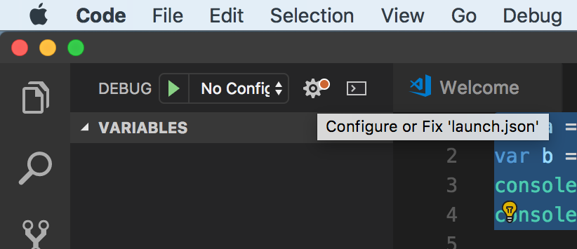

# Debugging techniques and VS Code debugger

Debugging is an important and essential skill for you and your team. Get good at this and you and your team will thank you for it!

> Every error is an opportunity to learn, almost always about yourself as a developer.

## Learning checklist

- how to debug well
  - read error messages / stack trace
  - debugging should be a scientific and systematic process
  - know how to google
  - reproducible bugs are a Good Thing
  - include new test(s) for the bug that you just fixed. (a.k.a. 'Find Bugs Once' - Once a human tester finds a bug, it should be the last time a human tester finds that bug. Automatic tests should check for it from then on. (Pragmatic Programmer))
- configure VS Code for debugging
  - debug command line node applications
  - debug web applications (e.g. web apps built with react)
  - debug tests written in jest
- how to use vs code debugger
  - add breakpoint
  - start debugger (F5) / Stop debugger (shift + F5) / restart debugger (shift + cmd + F5)
  - Go to next breakpoint (F5)
  - Step Over (F10)
  - Step Into (F11) / Step Out (shift + F11)
  - Note: Step over and step into does the same thing, except when the line is a function call (in which case, 'step into' will go to the code implementation of that line of code)

## Debug Node Application with VS Code

- Create a directory `mkdir learn-debugging && cd learn-debugging`
- Create a javscript file: `touch main.js`
- Create some variables for us to inspect later. Example:

```javascript
var a = 2;
var b = 40;
var c = a + b;

console.log(c);
```

- Open the VSCode debugger sidebar (`shift` + `cmd` + `D` for mac)
- Click on the gear icon on the top left and select 'Node.js' (because we're running our javascript code using `node` in this example). This will create a `launch.json` config file for the debugger



- The default config created by VS Code will work for this example, so no other changes are required. It will run `"${workspaceFolder}/main.js"` in debug mode, so make sure your javascript file is named `main.js`

```json
{
  "version": "0.2.0",
  "configurations": [
    {
      "type": "node",
      "request": "launch",
      "name": "Launch Program",
      "program": "${workspaceFolder}/main.js"
    }
  ]
}
```

- Now we're ready to use the debugger!
  - Add some breakpoints in `main.js`
  - Hit `F5` to start debugger
  - Inspect the value of your variables by typing those variable names in the Debug Console
  - Try writing some other javascript code and use the debugger to inspect it. Here are some suggested examples that you can try (one a at time!):

```javascript
//  example 1: inspect the values of `i` and `result` in the for loop
for (var i = 1; i < 10; i++) {
  var result = i * 2;

  console.log(result);
}

// example 2: fizzbuzz. inspect the values of `input` and `output`
function fizzbuzz(input) {
  var output = "";
  if (input % 3 == 0) {
    output += "Fizz";
  }
  if (input % 5 == 0) {
    output += "Buzz";
  }

  if (input % 3 != 0 && input % 5 != 0) {
    output = String(input);
  }
  return output;
}

fizzbuzz(3)
```

## A Project with Sample Configuration for VS Code Debugger

There is a sample application with pre-configured VS Code launch.json. You can use it as a reference when you need to configure VS code for debugging node based applications.

```shell
git clone https://github.com/thoughtworks-jumpstart/node_app_starter_project.git

cd node_app_starter_project

yarn install
```

## Resources

### Recommended reading

- [Great article on learning how to debug](http://blog.codeunion.io/2014/09/03/teaching-novices-how-to-debug-code/)
- [7 Steps to Debug Efficiently and Effectively](https://www.codementor.io/mattgoldspink/how-to-debug-code-efficiently-and-effectively-du107u9jh)

### References

- [VS Code Debugging guide](https://code.visualstudio.com/docs/editor/debugging)
