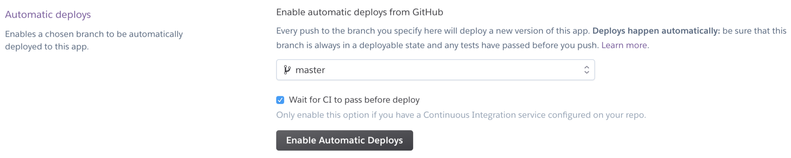

#### Continuous Integration: Running tests before deployment

In this example, we are deploying to Heroku, but we're going run tests on TravisCI before deploying to Heroku. 

**Pre-requisites**:
- a [travisCI account](http://www.travis-ci.org/)
- an express app (with all tests passing) that's committed to git and github on the master branch
- heroku cli tool. Check if it's installed: `heroku -v` (if not, install it with: `brew install heroku` (mac) or `choco install heroku-cli` (windows))

**Steps**:

- Visit https://travis-ci.org and add repo as a travis project
- Launch a terminal and change current directory to home directory of your project
- create an empty `.travis.yml` file in your project directory: `touch .travis.yml`
- add the following configuration to `.travis.yml`:

```yml
language: node_js
node_js:
  - "9"
cache:
  directories:
  - node_modules
services:
  - mongodb
script:
  - yarn test
deploy:
  provider: heroku
  app: swift-waters-95000 # replace this with the name of your heroku app
  on:
    repo: davified/temp_heroku_travis   # replace this with your_github_username/your_repo
```

- Generate secure api_key in `.travis.yml`: `travis encrypt $(heroku auth:token) --add deploy.api_key`
- `git add`, `git commit` and `git push` `.travis.yml`
- Go to https://dashboard.heroku.com/ to complete the Heroku-Github integration
  - Click on your project
  - Click on Deploy tab → Deployment method → select GitHub
  
  - Search for the repo of the application that you’re deploying → click Connect
  
  - Further below, click on ‘Wait for CI to pass before deploy’ and ‘Enable Automatic Deploy’
- Lastly, add any database add-ons that you're using on heroku and add the necessary config vars (if any) on the heroku dashboard

#### Resources
- [Demo app on TravisCI](https://github.com/davified/temp_heroku_travis)
- [TravisCI and Heroku](https://github.com/verekia/js-stack-from-scratch/blob/master/tutorial/09-travis-coveralls-heroku.md#readme)
- [Running cypress e2e tests on TravisCI](https://docs.cypress.io/guides/guides/continuous-integration.html)
- [Adding multiple stages on TravisCI](https://docs.travis-ci.com/user/build-stages/deploy-heroku/)