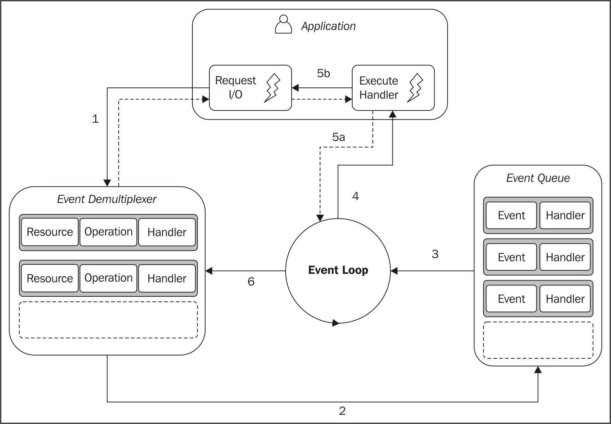

# Javascript Event Loop

The Javascript codes are executed by Javascript engines (which is a core part of browsers in the front end, and part of Node.JS platform in the back end).

There are some unique design patterns followed by the Javascript engine, which is important to be aware if you want to become a proficient Javascript developer.

Let's start by looking at the basic concepts.


## 5 Essential Concepts

- **Call Stack**: Everytime a function is executed, a stack of frames (i.e. other function calls) is added, and as the frames finish execution, they are removed from the stack
  - What’s a stack? A stack is an array-like data structure but it can only add items to the back and only remove the last item. In short, it's Last In First Out (LIFO), like a stack of plates
- **Heap**: This is part of computer memory allocated to store Javascript objects.
- **Event Table**: The event table contains a key-value mapping between **events** and the corresponding **event handler** (which is a **callback function**).  Every time an event is emitted (e.g. click), it is checked against the event table. If the event is in the table, the event handler is added to the message queue. If there is no listener, the event is lost.
- **Message Queue (a.k.a. Event Queue)**: The javascript engine (e.g. Chrome V8) repeatly checks if there's anything in the event queue. If there is an event in the queue, and if the call stack is empty, it will move the message to the call stack.
  - What’s a queue? A queue is an array-like data structure but it can only add items to the back and only remove the first item. In short, it's First In First Out (FIFO), like a queue at the cashier
- **Event Loop**: The event loop got its name because of how it's usually implemented:
  - It keeps looping to check if there's anything in the message queue
  - If there's no message in the message queue, the event loop keeps looping and waiting until an event emission causes a message to be added to the queue
  - If there's a message, it gets added to the call stack. The call stack runs to completion, and the empties itself.
    - When the call stack is empty, the next message in the event queue is added to the call stack

## Blocking vs Non-blocking (a.k.a Asynchronous) Tasks

The Javascript engine only provide one thread to run the event loop. We need to understand the implication of this fact.

One of the implication is if a task takes too long to finish, all the other events in the Event Queue cannot be processed in time, then end users may feel the UI is not responsive. For example, if a user clicks a button and the event handler is triggered and put into the Event Queue, however, there is a long-running task that hogs the Call Stack, then the button-click event handler will not be run in time, and the user would wonder why the button does not work.

This kind of **blocking** behavior can be a result of CPU-intensive number-crunching task, or a result of calling some [blocking API](https://nodejs.org/en/docs/guides/blocking-vs-non-blocking/). One typical blocking task is call synchronous I/O tasks, which happens when your application needs to read a file from hard disk (or make an HTTP request) and it waits for the result to be ready before it moves to the next step.

```javascript
const data = fs.readFileSync(...)
console.log(data);
```

Writing code in this kind of **synchronous** style is very common (you have already written some code like this in the past!), but if your code needs to be executed by Javascript engine, it's generally a bad behavior and we should avoid it. Most of the time, the tasks in the event queue should be finished quickly, and if a task needs to take sometime (e.g. reading a file from hard disk), the task should be executed **asynchronously**.

What do it mean by running a task asynchronously? Let's look at one example:
> Analogy: Ordering food at a restaurant. You go to your favorite fast food restaurant and you get in line. Once it’s your turn, your server takes your order. Your server delegate the order to the kitchen and gives you a waiting number, so that they can call you back when your burger is ready. This is an extremely efficient model because the server can quickly process many orders. Compare this with another approach, whereas the server takes your order, wait for it to be prepared while other customers wait in line, and finally move to the next person in line once your burger is ready. Most of the time, the server is just waiting and doing nothing, while he/she could have served the next person in line.

This asynchronous execution process can be illustrated with the picture below:



(credit: the image is taken from the book [Node Design Patterns](https://www.packtpub.com/web-development/nodejs-design-patterns-second-edition))

Note that there is a new component we introduced in the picture called "**Event Demultiplexer**". This is a component to hold the asynchronous tasks while the underlying operating system is working on the request. For example, if the task is to read a file from hard disk, the task would call an operating system API to read the file, and then be parked with the "**Event Demultiplexer**" until operating system notifies Javascript engine that the file is ready to be consumed. Note that there is an **Handler** associated with each task, which will be called by the Javascript engine to handle the event.

Let's go through the steps:

1. The application generates a new I/O operation by submitting a request to the **Event Demultiplexer**. The application also specifies a **handler**, which will be invoked when the operation completes. Submitting a new request to the Event Demultiplexer is a **non-blocking call** and it immediately returns control to the application.

2. When a set of I/O operations completes, the **Event Demultiplexer** receives notification from the operating system and pushes the new events into the **Event Queue**.

3. At this point, the **Event Loop** iterates over the items of the **Event Queue**.

4. For each event, the associated **handler** is invoked.

5. The handler, which is part of the application code, will give back control to the **Event Loop** when its execution completes (5a). However, new **asynchronous operations** might be requested during the execution of the handler (5b), causing new operations to be inserted in the **Event Demultiplexer** (this is step 1), before control is given back to the **Event Loop**.

6. When all the items in the **Event Queue** are processed, the loop will block again on the **Event Demultiplexer** which will then trigger another cycle when a new event is available.

Now we understand the importance of asynchronous tasks, how can we write code to make them asynchronous? Javascript provides a few tools for this purpose and we will cover them in the following sections:

- callback
- promise
- async/await

## Recommended reading

- [MDN docs on the event loop](https://developer.mozilla.org/en-US/docs/Web/JavaScript/EventLoop)
- [What is the event loop](https://hackernoon.com/understanding-js-the-event-loop-959beae3ac40)