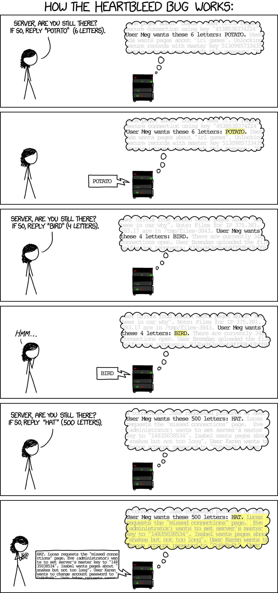

## Common Attacks

### Cross Site Scripting (XSS)

### Cross Site Request Forgery (XSRF or CSRF)

## Cross Site Request Forgery (XSRF or CSRF)

https://en.wikipedia.org/wiki/Cross-site_request_forgery

## Understanding Local Storage, Session Storage vs Cookies

- https://scotch.io/@PratyushB/local-storage-vs-session-storage-vs-cookie
- https://stackoverflow.com/questions/19867599/what-is-the-difference-between-localstorage-sessionstorage-session-and-cookies
- https://stackoverflow.com/questions/5523140/html5-local-storage-vs-session-storage
- http://javascript.tutorialhorizon.com/2015/09/08/getting-started-with-localstorage-vs-sessionstorage-in-html5/
- https://www.youtube.com/watch?v=AwicscsvGLg

## Do I need to sign my session cookie?

https://stackoverflow.com/questions/3240246/signed-session-cookies-a-good-idea/3240420#3240420

### Other Resources

- https://haveibeenpwned.com/

- https://nemethgergely.com/building-secure-javascript-applications/ 

