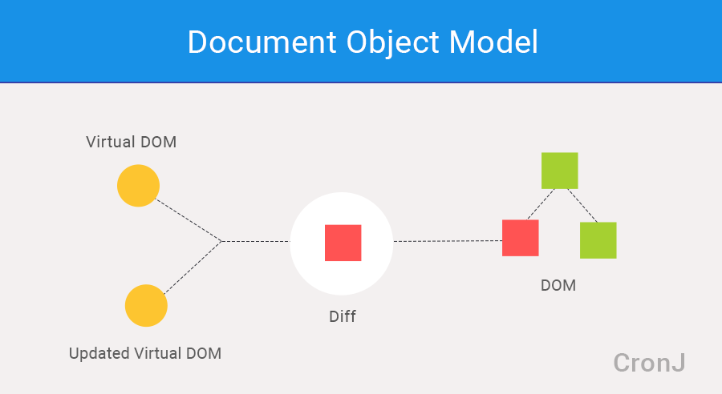

# Virtual DOM

Internally, React has a virtual DOM and a 'diff-ing' mechanism to calculate what has changed, and React only updates what’s necessary! (See example [here](https://codepen.io/gaearon/pen/zKRGpo?editors=0010) - inspect Elements and observe that only the h2 tag in the DOM is changing)

Further reading:
- https://hackernoon.com/virtual-dom-in-reactjs-43a3fdb1d130
