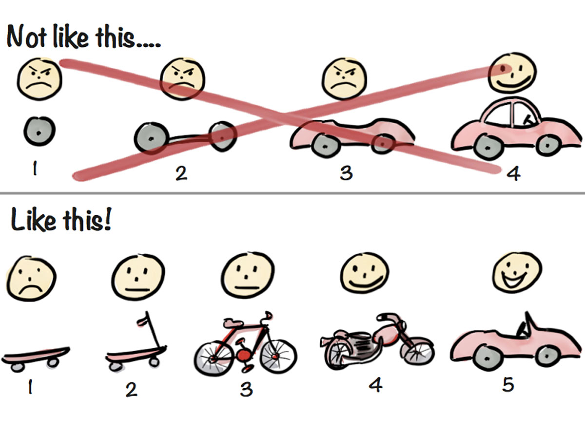

# Agile 101

### Learning objectives
- the goal of agile
- the objectives of agile
- agile principles
- ceremonies
	- inceptions
	- release planning
	- daily stand-up
	- kick off
	- desk checks
	- showcase
	- retros
- techniques
	- pair programming
	- TDD
	- iterations
	- user stories
	- story board
	- cross functional teams
(Note: this is not an exhaustive list!)

### What is agile?
A way of collaboratively building services, products, and software that is all about planning for, and assuming **change**

### The [agile manifesto](http://agilemanifesto.org/)

We are uncovering better ways of developing software by doing it and helping others do it. Through this work we have come to value:

- **Individuals and interactions** over processes and tools
- **Working software** over comprehensive documentation
- **Customer collaboration** over contract negotiation
- **Responding to change** over following a plan

Essentially, the goal of agile practices is to allow teams to:
- make feedback loops shorter
- make people awesome
- deliver value continuously
- experiment and learn rapidly
- make safety a prerequisite

### Agile principles
- Our highest priority is to satisfy the customer through **early and continuous delivery of valuable software**.
- **Welcome changing requirements**, even late in development. Agile processes harness change for the customer's competitive advantage.
- **Deliver working software frequently**, from a couple of weeks to a couple of months, with a preference to the shorter timescale.
- **Business people and developers must work together daily** throughout the project.
- Build projects around **motivated individuals**. Give them the environment and support they need, and trust them to get the job done.
- The most efficient and effective method of conveying information to and within a development team is **face-to-face** conversation.
- **Working software** is the primary measure of progress.
- Agile processes promote **sustainable development**. The sponsors, developers, and users should be able to maintain a constant pace indefinitely.
- Continuous attention to **technical excellence and good design** enhances agility.
- **Simplicity**--the art of maximizing the amount of work not done--is essential.
- The best architectures, requirements, and designs emerge from **self-organizing teams**.
- At regular intervals, the team **reflects on how to become more effective**, then tunes and adjusts its behavior accordingly.

### Iterative software delivery

### Lab:

**Origami time!**

### Resources
- [Software Design in the 21st Century](https://www.youtube.com/watch?v=1sDBVid419M)
- [Modern Agile](https://www.youtube.com/watch?v=ChTDwUK3Fw0)
- https://jessefewell.com/agile-vs-agile/
- [Retrospectives Wiki](http://retrospectivewiki.org/index.php?title=Retrospective_Plans)

### Topics to cover

- Agile team roles in context
	- Experience design / user testing
	- QA in context & types of testing, testing pyramid
	- BA 
- User stories - INVEST, Acceptance criteria, vertical slices, proper sizing, patterns and antipatterns
- Cross functional requirements
	- Security in our DNA
- Inception Process
- Feedback
- Retrospectives
- Effective communication
- Vertical slicing of application layers
- Continuous integration
- Continuous delivery (or how to release software)