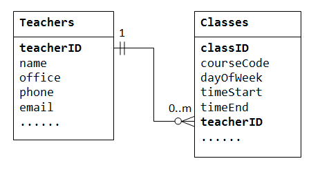
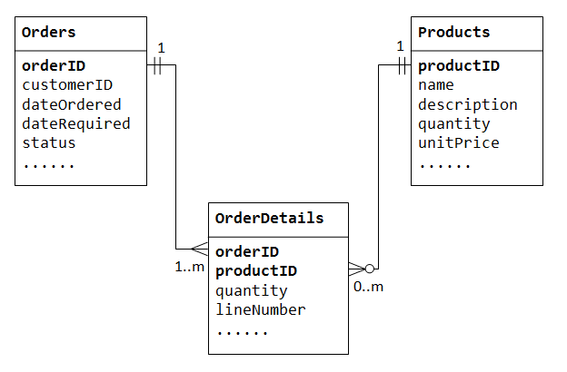
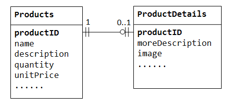

# Introduction to Relational Database

## Learning checklist

* Concepts of Relational Database
* Database Modeling
* Common Brands
* SQL
* Installing PostgreSQL Database
* Lab: Sequelize

## Concepts of Relational Database

* Concepts
  * Table/Row/Column
  * Schema
    * Schema Migration
  * Primary Key, Foreign Key
  * View
  * Index
  * SQL Query
    * Selection
    * Join
  * Transactions
    * ACID property
  * Lock
* Object Relational Mapping \(ORM\) Libraries

## Introduction

Relational Database was proposed by Edgar Codd (IBM Research) in 1969. It has since become the dominant database model for applications. Today there are many commercial `Relational Database Management System`(RDBMS) such as `Oracle`, `Microsoft SQL Server`. There are also many free, open-source RDBMS such as `mySQL`, `PostgreSQL`

A relational DB organizes data in tables. A table is made up of rows and columns. A row is called a record. A column is called a field(or attribute). A database table is similar to a spreadsheet.

However the relationship that can be created among tables enables a relational database to efficiently store huge amount of data, and effectively retrieve selected data

A language called SQL(Structured Query Language) was developed to work with relational databases

## Database Modeling

A well-designed database shall
* eliminate data redundancy
* ensure data integrity and accuracy

There are mainly 4 steps to designing a database
* Step 1 - Define the purpose of the database(requirement anaylsis)
* Step 2 - Gather data, organize in tables and specify primary key and foreign keys(if any)
  * In each table, we have to choose one column or a few columns to be the `primary key`, which uniquely identify each of the rows
* Step 3 - Create relationship among Tables
  * `one-to-many`
  * `many-to-many`
  * `one-to-one`
* Step 4 - Normalization

## Primary key

In relational database, a table cannot contain duplicate rows, because that would create ambiguities in retrieval of data. To ensure uniqueness, each table should have a column or a set of columns called a primary key, that uniquely identifies every records of the table.

For example, an unique number `customerID` can be used as a primary key for the Customers table, `productCode` for Products table, `isbn` for a Books table.

A primary key is called a `simple key` if it is a single column. It is called a `composite key` if it is made up of several columns.

### Consideration for choosing primary key:

* The primary key shall be simple and familiar, `employeeID` for employees table and `isbn` for books table.
* The value of the primary key should not change. Primary key is used to reference other tables. If you change its value, you have to change all its references; otherwise, the references will be lost. For example, phoneNumber may not be appropriate to be used as primary key for table Customers, because it might change.
* Primary key often uses integer (or number) type. But it could also be other types, such as texts. However, it is best to use numeric column as primary key for efficiency.
* Primary key could take an arbitrary number. Most RDBMSs support so-called auto-increment (or AutoNumber type) for integer primary key, where (current maximum value + 1) is assigned to the new record. This arbitrary number is fact-less, as it contains no factual information. Unlike factual information such as phone number, `fact-less` number is ideal for primary key, as it does not change.
* Primary key is usually a single column (e.g., customerID or productCode). But it could also make up of several columns. You should use as few columns as possible.

Example - a table customers contains columns `lastName`, `firstName`, `phoneNumber`,`address`, `city`, `state`, `zipCode`. The candidates for primary key are name=(lastName, firstName), phoneNumber, Address1=(address, city, state), Address1=(address, zipCode). Name may not be unique. Phone number and address may change. Hence, it is better to create a fact-less auto-increment number, say `customerID`, as the primary key.

## Creating relationship among tables

A database consisting of `independent` and `unrelated` tables serves little purpose (you may consider to use a spreadsheet instead).
The power of relational database lies in the relationship that can be defined between tables. The most crucial aspect in designing a relational database is to identify the relationships among tables. The types of relationship include:

* one-to-many
* many-to-many
* one-to-one

### One-to-many
For example, think of a `class_roster` database, a teacher may teach zero or more classes, while a class is taught by one(and only one) teacher.

Second example, think of a `company` database, a manager manages zero or more employees, while an employee is managed by one(and only one) manager.

Third example, think of a `product_sales` database, a customer may place many orders, while an order is placed by one(and only one) customer.

All the examples have something in common which is a relationship called one-to-many

We will illustrate the example of the `class roster` database in the diagram below.

To support a `one-to-many` relationship, we need to design two tables:
a table `Classes` to store information about the classes with `classID` as the `primary key`

a table `Teachers` to store information about teachers with `teacherID` as the `primary key`.

We can then create the `one-to-many` relationship by storing the primary key of the table Teacher (i.e., teacherID) (the "one"-end or the parent table) in the table classes (the "many"-end or the child table), as illustrated below.



The column `teacherID` in the child table `Classes` is known as the `foreign key`. `A foreign key of a child table is a primary key of a parent table, used to reference the parent table`.

### Many-to-many
For example, in a "product sales" database, a customer's order may contain one or more products; and a product can appear in many orders.

In a "bookstore" database, a book is written by one or more authors; while an author may write zero or more books.

This kind of relationship is known as many-to-many.

To support `many-to-many` relationship, we need to create a third table known as a `junction table`, say OrderDetails (or OrderLines), where each row represents an item of a particular order. For the `OrderDetails` table, the primary key consists of two columns: `orderID` and `productID`, that uniquely identify each row. The columns orderID and productID in OrderDetails table are used to reference Orders and Products tables, hence, they are also the `foreign keys` in the OrderDetails table.



The `many-to-many` relationship is, in fact, implemented as two `one-to-many` relationships, with the introduction of the junction table.

An order has many items in `OrderDetails`. An OrderDetails item belongs to one particular order.

A product may appears in many `OrderDetails`. Each OrderDetails item specified one product.

### One-to-one
For example in a `product sales` database, a product may have optional supplementary information such as image, moreDescription and comment. Keeping them inside the Products table results in many empty spaces (in those records without these optional data). Furthermore, these large data may degrade the performance of the database.

Instead, we can create another table (say ProductDetails, ProductLines or ProductExtras) to store the optional data. A record will only be created for those products with optional data. The two tables, Products and ProductDetails, exhibit a one-to-one relationship. That is, for every row in the parent table, there is at most one row (possibly zero) in the child table. The same column productID should be used as the primary key for both tables.

Some databases limit the number of columns that can be created inside a table. You could use a one-to-one relationship to split the data into two tables. One-to-one relationship is also useful for storing certain sensitive data in a secure table, while the non-sensitive ones in the main table.




### Extra DB Concepts

### Normalization
Normalization is a database design technique which organizes tables in a manner that minimizes redundancy and dependency of data. It divides larger tables to smaller tables and links them using relationships

Here is a good resource for understanding normalization - [Normalization of database](https://www.studytonight.com/dbms/database-normalization.php)

* `First Normal Form (1NF)` - A table is 1NF if every cell contains a single value, not a list of values. This properties is known as atomic. 1NF also prohibits repeating group of columns such as item1, item2,.., itemN. Instead, you should create another table using one-to-many relationship.

* `Second Normal Form (2NF)` - A table is 2NF, if it is 1NF and every non-key column is fully dependent on the primary key. Furthermore, if the primary key is made up of several columns, every non-key column shall depend on the entire set and not part of it.

* `Third Normal Form (3NF)` - A table is 3NF, if it is 2NF and the non-key columns are independent of each others. In other words, the non-key columns are dependent on primary key, only on the primary key and nothing else.

* There is also a higher form than 3NF called `Higher Normal Form` - 3NF has its inadequacies, which leads to higher Normal form, such as Boyce/Codd Normal form, Fourth Normal Form (4NF) and Fifth Normal Form (5NF)


### Integrity Rules for database modelling and design
* Entity Integrity Rule: The primary key cannot contain NULL. Otherwise, it cannot uniquely identify the row. For composite key made up of several columns, none of the column can contain NULL. Most of the RDBMS check and enforce this rule.

* Referential Integrity Rule: Each foreign key value must be matched to a primary key value in the table referenced (or parent table). You can insert a row with a foreign key in the child table only if the value exists in the parent table.
If the value of the key changes in the parent table (e.g., the row updated or deleted), all rows with this foreign key in the child table(s) must be handled accordingly. You could either (a) disallow the changes; (b) cascade the change (or delete the records) in the child tables accordingly; (c) set the key value in the child tables to NULL.
Most RDBMS can be setup to perform the check and ensure the referential integrity, in the specified manner.


### A sample database

Here is a sample database which models a DVD rental business. It's created by the author of [this postgres tutorial](http://www.postgresqltutorial.com/postgresql-sample-database/).

This kind of data base model is also called ER model or [Entity Relationship Model](https://en.wikipedia.org/wiki/Entity–relationship_model)

In this diagram, the funny annotations in the link follows [Crow Foot Notation](https://www.codeproject.com/Articles/878359/Data-modelling-using-ERD-with-Crow-Foot-Notation) to represent different types of relationships \(one-to-one, one-to-many, etc\) between the entities.


## Common SQL Server

* SQL Server
* Oracle
* MySQL
* [PostgreSQL](https://www.postgresql.org/)
* [SQLite](https://www.sqlite.org/index.html)

## SQL

Tutorials to learn SQL

* [SQL Tutorial](http://www.sqltutorial.org/)
* [A step-by-step tutorial to try SQL with SQLite](http://swcarpentry.github.io/sql-novice-survey/)
* [SQL Introductory Course](http://www.sqlcourse.com/)

Test your SQL knowledge

* [SQL Exercises](https://en.wikibooks.org/wiki/SQL_Exercises)

Reference for SQL Command

* [SQL Cheat Sheet](http://www.sqltutorial.org/sql-cheat-sheet/)
* [More Comprehensive Reference on SQL](https://goalkicker.com/SQLBook/)

## PostgreSQL Database

PostgreSQL is a powerful, open source object-relational database system with over 30 years of active development that has earned it a strong reputation for reliability, feature robustness, and performance.

### Installation

#### Installation On Mac

Remove previous versions of PostgreSQL(if installed previously)
```
brew uninstall --force postgresql

rm -rf /usr/local/var/postgres
```
Use this link and follow the 3 steps to install [Postgres.app](https://postgresapp.com/)

To connect directly from the command line, type `psql`

##### Install pgAdmin4(GUI client for Postgres) for Mac
* Click on this link [PGAdmin4](https://www.postgresql.org/ftp/pgadmin/pgadmin4/v3.4/macos/)
* Download the file `pgadmin4-3-4.dmg`

##### Configure pgAdmin4
* Ensure your `PostgreSQL` app service is running in the background
* On the dashboard page, click on `Add new server`
* Enter `localhost` as name on the `General` tab
* Click on the `Connection` tab and enter
  * `localhost` as the `Host name/address`
  * Leave the rest as default and click `save`
* Now `pgAdmin4` should be connected to your `postgres db server`

#### Installation On Windows
Follow the instructions from this link to install postgres on Windows. This will install `PostgreSQL`, `pgAdmin4` through a packaged installer from Enterprise DB
[install-postgresql-windows](http://www.postgresqltutorial.com/install-postgresql/)
Ensure by the end you are able to connect `pgAdmin` to your `postgres db server`

### Verify your installation
Ensure to close any open session of terminal before verifying
```text
postgres --version
```

### Start/Stop the PostgreSQL Server

* For Mac
  * Use the Postgres.app icon in your status bar to start and stop your server

* For Windows
  * Use the `pgAdmin` tool to manage your server


### Using terminal for PostgreSQL
* For Mac
  * Use your terminal and type in `psql`

* For Windows
  * Search for a tool called `psql`
  * It will prompt your for additional inputs to connect to the terminal
  * All will be default. Just keep clicking enter until the password. This password comes from when you installed the `PostgreSQL` with the installer previously

  * Another way is using through `gitbash`. Ensure to set the environment variable path for the psql/bin folder
  * `psql -U <username> <database-name>`
    * if you have installed with all the defaults username will be `postgres`
    * `psql -U postgres test-db-1`
    * This will trigger the password authentication which you must provide with the password created earlier

### Create a Database

```text
createdb test-db-1
```

For windows, you might need to create the database from the tool `pgAdmin`

### Connect to the Database

```text
psql test-db-1
```
 For windows, you will need to connect to the created database using the tool `psql`. Upon clicking you will need to make a few choices
 * `localhost` is default - hit enter
 * `database` is the newly created database - type `test-db-1`
 * `port` is `5432` by default - hit enter
 * `username` is `postgres` by default - hit enter
 * `password` - Enter your created password

This would open a shell for you to interact with the database. You can type `help` at the shell to see which commands you can use.

Here are a few sample commands

* `\list` : List all of your actual databases.
* `\c my-database-name` : Connect to another database.
* `\d` : List the tables in your currently connected database.
* `\d my-table-name` : Shows information for a specific table.

### Create Tables

Let's create a table to store some user records.

```sql
create table users(id serial, name varchar(25));
```

### Insert Data to Tables

```sql
insert into users(name) values('gordon');
insert into users(name) values('david');
```

### Query Data

```sql
select * from users;
```

### Disconnect

Just type `\q` command to disonnect from the database.

### Drop the Database

Later, when you don't need this database, you can drop it by

```text
dropdb test-db-1
```

### Restoring sample DB
We will be restoring a sample database provided [here](http://www.postgresqltutorial.com/postgresql-sample-database/) so that we have an ample set of data to go through the fundamental of SQL

Download the DVD rental sample database and extract it to get `dvdrental.tar`. On `Mac` you might need to use the `unzip` command to retrieve it in this format

Open your `pgAdmin` tool
  * Right-click on the server connection and `Create Database`
  * Name it `dvdrental`
  * Right-click on `dvdrental` db and choose `restore`
  * Choose the extracted tar from your file system and click restore
  * This will restore all the tables created in your `dvdrental` database

### Other GUI Client for PostgreSQL

If you prefer to work with GUI tools, you can try out the following ones:

* [pgAdmin](https://www.pgadmin.org/)
* [DBeaver](https://dbeaver.io/)
* [TeamSQL](https://teamsql.io/)

### Tutorials for PostgreSQL

Here is a [tutorial](http://www.postgresqltutorial.com/) for learning PostgreSQL. It's written for windows users, but the same commands \(like `psql`\) is available in other platforms too.

You can find another [guide for beginner here](http://postgresguide.com/)

### Exercises
* [Postgres Exercises](https://pgexercises.com/)

## Object Relational Mapping \(ORM\) Tool: Sequelize

If you are tired of using SQL to interact with your database, you can also use [Object Relational Mapping\(ORM\)](https://en.wikipedia.org/wiki/Object-relational_mapping) tools, which helps to convert your information from the database to your JavaScript application without performing SQL statements yourself.

[Sequelize](https://github.com/sequelize/sequelize) is such an ORM which supports multiple dialects whereas PostgreSQL is one of those dialects.

### Tutorials for Sequelize

You can follow the tutorial at [How to use Sequelize with Node and Express](https://www.codementor.io/mirko0/how-to-use-sequelize-with-node-and-express-i24l67cuz) to learn how to use Sequelize to build a CRUD REST API.

Note:

* The author forgot one step: you need to run `npm init` after you get into the `sequelize_example` directory.
* You need to keep your PostgreSQL server running when doing this tutorial
* Understand the models and the relationships created between the models in the tutorials
* Try to follow the tutorial before looking at the sample code in the provided link below

The sample codes after completing the tutorial can be found at \[[https://github.com/thoughtworks-jumpstart/sequelize\_example](https://github.com/thoughtworks-jumpstart/sequelize_example)\]

Extra:

* If you're done and understood the tutorial, try converting the code from `promises` to `async-await`

Sample code for using async-await [sequelize-async-await](https://github.com/thoughtworks-jumpstart/sequelize_example_async_await)

More Tutorials on Sequelize

* [Setup PostgreSQL with Sequelize in Express Tutorial](https://www.robinwieruch.de/postgres-express-setup-tutorial/)
* [Sequelize CRUD 101](https://lorenstewart.me/2016/10/03/sequelize-crud-101/)
* [Object-Relational Mapping in Node.js with Sequelize](https://www.codementor.io/hari577/object-relational-mapping-in-nodejs-with-sequelize-du1088h3l)

## Resources

* [Reference on PostgreSQL](https://goalkicker.com/PostgreSQLBook/)
* [SQL Learning Track on Bento.io](https://bento.io/topic/sql)