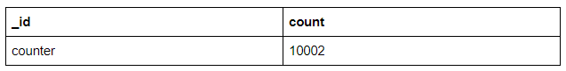

# Web Service with MongoDB

In this section, we are going to learn how to work with MongoDB.

## What is MongoDB

MongoDB is one of the **NoSQL** databases, more specifically, it's a **document** database, because it stores documents in BSON\(a binary form of JSON\) format like the one below:

```javascript
{
  firstName: "Gordon",
  lastName: "Song"
}
```

A document then is placed within a **collection**. As an example, the JSON document above defines a `user` object. This user object then would typically be part of a collection called `users`. For those who are familiar with relational databases, a collection in MongoDB is similar to a table in relational database, and a document in MongoDB is similar to a row in relational databases.

Here are some of the key concepts:

* Database
* [Collection ~ Table](https://docs.mongodb.com/manual/core/databases-and-collections/)
* [Document ~ Row \(without Schema\)](https://docs.mongodb.com/manual/core/document/)
* Each document has a "\_id" field which is a GUID \(Globally Unique Identifier\)
* [Index](https://docs.mongodb.com/manual/indexes/)
* [Query](https://docs.mongodb.com/manual/crud/)
* [Reference](https://docs.mongodb.com/manual/reference/database-references/index.html)

Here are some of the features it offers:

* MongoDB stores data in flexible, JSON-like documents, meaning fields can vary from document to document and data structure can be changed over time
* The document model maps to the objects in your application code, making data easy to work with
* MongoDB is a distributed database at its core, so [high availability](https://en.wikipedia.org/wiki/High_availability), [horizontal scaling](https://stackoverflow.com/questions/11707879/difference-between-scaling-horizontally-and-vertically-for-databases), and [geographic distribution](https://en.wikipedia.org/wiki/Distributed_database) are built in and easy to use
* [Join of documents across collections](https://docs.mongodb.com/manual/reference/operator/aggregation/lookup/)
* \(Starting from 4.0 release\), [ACID transaction across multiple documents is also supported](https://www.mongodb.com/transactions)
* MongoDB creates databases and collections on demand if they do not already exist.

More information can be found on their [documentation website](https://docs.mongodb.com/manual/introduction/)

And here is [a good comparison between MongoDB and relational DB \(e.g. PostgresSQL\)](https://www.mongodb.com/compare/mongodb-postgresql)

## Installing MongoDB

### macOS with Homebrew

    brew install mongodb

### Windows and Linux

Download the Community Server from https://www.mongodb.com/download-center#community
for your specific OS version.

If you're running Windows, please add the MongoDB `bin` folder to your System
PATH (e.g. `C:\Program Files\MongoDB\Server\4.0\bin`).

**Verify** the installation by running the following command:

    mongod --version

You should see the version information printed on your console.

## Start your MongoDB server

    mongod --dbpath /data/mongodb

The `--dbpath` option specifies the location where MongoDB should store data.
It can be any folder you create. `/data/mongodb` is just one example.

Note that the path to `mongod.exe` and the path to your data folder could be
different on your system.

Depending on the security level of your system, Windows may pop up a Security
Alert dialog box about blocking “some features” of C:\Program
Files\MongoDB\Server\3.6\bin\mongod.exe from communicating on networks. All
users should select Private Networks, such as my home or work network and click
Allow access.

Once the MongoDB server is started, you should see the following line on your console:

```text
[initandlisten] waiting for connections on port 27017
```

## Install a Visual Studio Code extension for viewing data in MongoDB

1. Open the Extensions pane in Visual Studio Code
2. Search for the _Azure Cosmos DB_ extension by Microsoft
3. Install it and Reload vscode once the installation completes
4. Click the new Azure icon in the left sidebar
5. Create a new MongoDB connection by clicking the 'plug' icon and selecting
   'MongoDB' from the dropdown

## Tutorial: Learn Mongoose API

[Mongoose](http://mongoosejs.com/) is an **Object Document Mapper \(ODM\)**.
This means that Mongoose allows you to define objects with a strongly-typed
[schema](http://mongoosejs.com/docs/guide.html) that is mapped to a MongoDB
document.

Firstly, read the ['Get Started' section on Mongoose
Documentation](http://mongoosejs.com/docs/index.html) to get an overview of
Mongoose API.

Then you can see a few more examples on the API in [this
article](https://coursework.vschool.io/mongoose-crud/)

Now, let's follow [this
tutorial](https://code.tutsplus.com/articles/an-introduction-to-mongoose-for-mongodb-and-nodejs--cms-29527)
to play with the Mongoose API.

Caveat on this tutorial:

* There are some syntax error in the code \(in the part that create new instance of models\)
* Many Mongoose APIs are asynchronous in nature. We need to refactor the codes with async/await syntax to avoid callback hell

A copy of the codes for the tutorial is checked into [our course material
repository as well](https://github.com/thoughtworks-jumpstart/mongoose-basics).
You can take it as a reference.

There are a few other good tutorials on Mongoose, you can try them out as well:

* [Object Modeling in Node.JS with Mongoose](https://devcenter.heroku.com/articles/nodejs-mongoose)
* [Easily Develop Node.js and MongoDB Apps with Mongoose](https://scotch.io/tutorials/using-mongoosejs-in-node-js-and-mongodb-applications)

### 3 Ways to Call Mongoose API

Most of the Mongoose APIs allow you to call them with callbacks. But if you
don't pass in callback, those APIs would return either a Promise or a Query
instead. Both Promise and Query have `.then()` function, which means you can
get the resolved value \(from the Promise or the Query\) by calling them with
`await`.

More details can be found in [the
documentation](http://mongoosejs.com/docs/promises.html)

We recommend using the `async/await` style.

## Lab: Adding MongoDB to a simple CRUD REST API

In this lab, you will start from a project without a database yet. There are
some skeleton codes written for an API to create/update/read/delete books. You
need to implement those API and store the data in a local Mongo database.

Here is the [project
repo](https://github.com/thoughtworks-jumpstart/express-books-api) for you to
fork and work on.

## Example: REST API with Express + Mongoose

We have created a sample project in the course material repository. Let's clone
this repository and study the codes related to mongodb access.

```text
git clone https://github.com/thoughtworks-jumpstart/express_passport_mongoose_example.git
cd express_passport_mongoose_example
npm install
```

There is a `models` folder which contains the models defined using Mongoose
schema API. Take a look at `User.js`.

The codes making use of the models can be found in the `middlewares` folder.
For example, the `user_middleware.js` has functions to create/save/update
users.

## Assignment

Update the `express-url-shortener` project to store the URLs into a MongoDB,
instead of storing them in memory.

You can create two collections to store the data you need

* A collection to store the URLs and their dynamically generated ID


* A collection to maintain the counter that will be auto-incremented when a new URL is stored in the previous collection. A new document is created in the previous collection with this newly incremented counter.



A sample Mongoose schema definition is given below

```javascript
const countersSchema = new mongoose.Schema({
    _id: { type: String, required: true },
    count: { type: Number, default: 0 }
});

const Counter = mongoose.model('Counter', countersSchema);

const urlSchema = new mongoose.Schema({
    _id: {type: Number},
    url: '',
    created_at: ''
});

const URL = mongoose.model('URL', urlSchema);
```

### Tips

#### Remember to start your MongoDB server before you start your Express application

Tips: If you are trying to run the express application locally, you need to start the local MongoDB instance before you call `npm start`. Otherwise, you will see the following error on your console when you try to call `mongoose.connect()`.

```text
UnhandledPromiseRejectionWarning: MongoNetworkError: failed to connect to server [localhost:27017] on first connect [MongoNetworkError: connect ECONNREFUSED 127.0.0.1:27017]
```

#### You will need to use the following APIs from Mongoose

Make sure you get familiar with the following APIs before you start doing this assignment.

Methods available on your model class:

* [findById](http://mongoosejs.com/docs/api.html#findbyid_findById)
* [findByIdAndUpdate](http://mongoosejs.com/docs/api.html#findbyidandupdate_findByIdAndUpdate)
* [findOne](http://mongoosejs.com/docs/api.html#findone_findOne)

Methods available on your model objects:

* [save](http://mongoosejs.com/docs/api.html#model_Model-save)
* [remove](http://mongoosejs.com/docs/api.html#model_Model-remove)

In case you need to do some operation before a model is saved:

* [pre](http://mongoosejs.com/docs/api.html#schema_Schema-pre)

#### You need to initialize the counter

Since the counter collection is empty in the beginning, you need to create one counter before you use it for the first time.

#### Don't Panic!

Credit: this assignment is inspired by the tutorial [How to Build a URL Shortener with Node.js and MongoDB](https://scalegrid.io/blog/how-to-build-a-url-shortener-with-node-js-and-mongodb/).

You are encouraged to attempt without checking the tutorial first. But if you are stuck and need some help on the solution, you can refer to that tutorial and modify the sample codes presented in the tutorial to work with our requirements. You should also convert the codes from callback style to async/await style.

## Resources

* [M101JS: MongoDB for Node.js Developers](https://university.mongodb.com/courses/M101JS/about)

