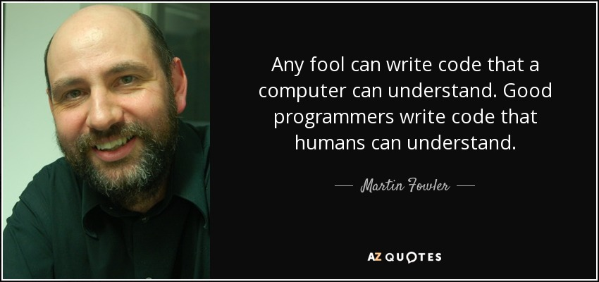

# Clean Code

> Poorly factored code is a problem because it's hard to understand. Code that's hard to understand is hard to modify, whether to add new features or to debug - Martin Fowler

The idea of writing clean code is to ensure that the software is: readable, maintainable and extensible. Clean code enables businesses to iterate quickly and create value without tearing too much hair out.

## Tips on Writing Clean Code

* [code smells](https://sourcemaking.com/refactoring/smells)
* basic hygiene:
  * clear and intention-revealing variable names
  * use constants instead of magic numbers
  * small functions and classes
  * one level of abstraction per function
  * don't use comments to explain what the code is doing
  * functions should do one thing
  * avoid [deep nesting / multiple levels of indentation](http://wiki.c2.com/?ArrowAntiPattern) 
  * consistent formatting / linting
  * error handling \(fail loudly and quickly\)
  * don't modify arguments of a function
  * avoid return null
* Kent Beck's [4 rules of simple design](https://blog.jbrains.ca/permalink/the-four-elements-of-simple-design):
  * Pass the tests
  * Reveal intention \(i.e. make your code readable\)
  * No duplication
  * Fewest elements    
* Design Guidelines
  * [SOLID Principle](https://github.com/ryanmcdermott/clean-code-javascript/#solid)
  * [Separation of Concerns](http://aspiringcraftsman.com/2008/01/03/art-of-separation-of-concerns/)
  * [Favour composition over inheritance](https://www.youtube.com/watch?v=wfMtDGfHWpA)
  * [Convention over Configuration](https://en.wikipedia.org/wiki/Convention_over_configuration)
  * [Do one thing and do it well](https://en.wikipedia.org/wiki/Unix_philosophy#Do_One_Thing_and_Do_It_Well)
  * [Loose coupling, high cohesion](https://thebojan.ninja/2015/04/08/high-cohesion-loose-coupling/)
  * Tell, don't ask \(a.k.a [Law of Demeter](https://en.wikipedia.org/wiki/Law_of_Demeter)\)
* Rule of Thumb
  * Don't Repeat Yourself \(DRY\)
  * Keep it stupid, simple \(KISS\) 
    * [YAGNI](https://martinfowler.com/bliki/Yagni.html) \(You are not going to need it\)
    * [Do the simplest thing that could possibly work](http://wiki.c2.com/?DoTheSimplestThingThatCouldPossiblyWork)
    * Avoid [Accential Complexity](http://wiki.c2.com/?AccidentalComplexity)
    * Avoid [Big Design Up Front](http://wiki.c2.com/?BigDesignUpFront)
    * "Perfection is achieved, not when there is nothing more to add, but when there is nothing left to take away."
* [The Boy Scout Rule](http://programmer.97things.oreilly.com/wiki/index.php/The_Boy_Scout_Rule)
* procedure vs functions
  * A procedure does not return anything and has side effects
  * A \(pure\) function has no side effect and return a result
* unit tests
  * one assertion per test
    * arrange/action/assert pattern
* [Refactoring techniques](https://sourcemaking.com/refactoring/refactorings)
  * Composing methods
    * Extract Method vs. Inline Method
    * Extract Variable vs. Inline Temp
    * Replace Temp with Query
  * Organizing data
    * Replace Magic Number with Symbolic Constant
  * And much much more!! \(see resources below for more refactoring techniques\)

## 5S Principles \(from Clean Code\)

* **Seiri**, or organization \(think “sort” in English\). Knowing where things are—using approaches such as suitable naming—is crucial. You think naming identifiers isn’t important?
* **Seiton**, or tidiness \(think “systematize” in English\). There is an old American saying: A place for everything, and everything in its place. A piece of code should be where you expect to find it—and, if not, you should re-factor to get it there.
* **Seiso**, or cleaning \(think “shine” in English\): Keep the workplace free of hanging wires, grease, scraps, and waste. What do the authors here say about littering your code with comments and commented-out code lines that capture history or wishes for the future? Get rid of them.
* **Seiketsu**, or standardization: The group agrees about how to keep the workplace clean. Do you think this book says anything about having a consistent coding style and set of practices within the group? Where do those standards come from? Read on.
* **Shutsuke**, or discipline \(self-discipline\). This means having the discipline to follow the practices and to frequently reflect on one’s work and be willing to change.

## Refactoring Dojo

[Refactoring a JavaScript video store](https://github.com/thoughtworks-jumpstart/videostore-refactoring-exercise)

## Learning checklist Resources

* Code Smells
  * [List of code smells](https://refactoring.guru/refactoring/smells)
    * [Another list of code smells](http://wiki.c2.com/?CodeSmell)
* Refactoring Techniques
  * [Martin Fowler's refactoring techniques catalogue](https://www.refactoring.com/catalog/index.html)
  * [List of refactoring techniques](https://sourcemaking.com/refactoring)
* SOLID Principles
  * [SOLID explained in a funny way](http://www.daedtech.com/visualization-mnemonics-for-software-principles/)
  * [SOLID OO Design in Javascript](https://medium.com/@cramirez92/s-o-l-i-d-the-first-5-priciples-of-object-oriented-design-with-javascript-790f6ac9b9fa)
* [Kent Beck's 4 rules of simple design](https://martinfowler.com/bliki/BeckDesignRules.html)
* [Clean code in Javascript](https://github.com/ryanmcdermott/clean-code-javascript/)
* [Clean Code Cheat Sheet](https://www.planetgeek.ch/2014/11/18/clean-code-cheat-sheet-v-2-4/)
* [Object calisthenics](http://aimforsimplicity.com/post/objectcalisthenicsgameoflifekata/)
* [Clean Code: A Handbook of Agile Software Craftsmanship](https://www.amazon.com/Clean-Code-Handbook-Software-Craftsmanship/dp/0132350882)
* [Clean Coders](https://cleancoders.com/)
* [The worst mistake of computer science](https://www.lucidchart.com/techblog/2015/08/31/the-worst-mistake-of-computer-science/)

## Assignment

### 1. Refactoring Kata

Instructions:

* Pair up and refactor each other's code
* Identify code smells and apply the refactoring techniques that you've learnt to make it better
* If you have any doubts, clarify it with your pair

### 2. Refactoring video store

For the [Refactoring a JavaScript video store](https://github.com/thoughtworks-jumpstart/videostore-refactoring-exercise) and refactor the codes by applying the principals learned in this session.

### 3. Code Retreat

* List of Problems to Choose From
  * Mars Rover
    * [Bowling Game](http://codingdojo.org/kata/Bowling/)

