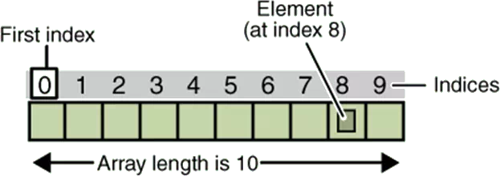
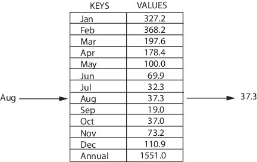
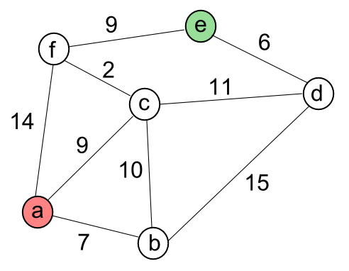

# Introduction: Data Structures

## What is a data structure

From Wikipedia:

> In computer science, a data structure is a particular way of organizing data in a computer so that it can be used efficiently.

“used efficiently” here means that according to your needs. You may need for example an organizing structure that allows very fast lookup or it could be very fast insertion or any thing related to your application.

The key thing to remember is that each data structure has it own advantages and disadvantages. There isn’t any one of them that would beat all of the others, that’s the reason why it is important to know them all.

## Examples

### Array

> An Array data structure, or simply an Array, is a data structure consisting of a collection of elements \(values or variables\), each identified by at least one array index or key. The simplest type of data structure is a linear array, also called one-dimensional array.

### List \(Linked List\)

> A Singly Linked List is a linear collection of data elements, called nodes pointing to the next node by means of pointer. It is a data structure consisting of a group of nodes which together represent a sequence. Under the simplest form, each node is composed of data and a reference \(in other words, a link\) to the next node in the sequence.

### Map

### Hash Map, Hash Table

> A Hash Table \(Hash Map\) is a data structure used to implement an associative array, a structure that can map keys to values. A Hash Table uses a hash function to compute an index into an array of buckets or slots, from which the desired value can be found.

### Set

> A Set is an abstract data type that can store certain values, without any particular order, and no repeated values. It is a computer implementation of the mathematical concept of a finite Set.

### Stack

> A Stack is an abstract data type that serves as a collection of elements, with two principal operations: push, which adds an element to the collection, and pop, which removes the most recently added element that was not yet removed. The order in which elements come off a Stack gives rise to its alternative name, LIFO \(for last in, first out\).

### Queue

> A Queue is a particular kind of abstract data type or collection in which the entities in the collection are kept in order and the principal operations are the addition of entities to the rear terminal position, known as enqueue, and removal of entities from the front terminal position, known as dequeue. This makes the Queue a First-In-First-Out \(FIFO\) data structure. In a FIFO data structure, the first element added to the Queue will be the first one to be removed.

### Tree

> A Tree is a widely used data structure that simulates a hierarchical tree structure, with a root value and subtrees of children with a parent node. A tree data structure can be defined recursively as a collection of nodes \(starting at a root node\), where each node is a data structure consisting of a value, together with a list of references to nodes \(the “children”\), with the constraints that no reference is duplicated, and none points to the root node.

### Binary Search Tree

> Binary search trees keep their keys in sorted order, so that lookup and other operations can use the principle of binary search: when looking for a key in a tree \(or a place to insert a new key\), they traverse the tree from root to leaf, making comparisons to keys stored in the nodes of the tree and deciding, on the basis of the comparison, to continue searching in the left or right subtrees.

### B+ Tree

> The primary value of a B+ tree is in storing data for efficient retrieval in a block-oriented storage context — in particular, filesystems. This is primarily because unlike binary search trees, B+ trees have very high fanout \(number of pointers to child nodes in a node,\[1\] typically on the order of 100 or more\), which reduces the number of I/O operations required to find an element in the tree.

### Graph

> A Graph data structure consists of a finite \(and possibly mutable\) set of vertices or nodes or points, together with a set of unordered pairs of these vertices for an undirected Graph or a set of ordered pairs for a directed Graph. These pairs are known as edges, arcs, or lines for an undirected Graph and as arrows, directed edges, directed arcs, or directed lines for a directed Graph. The vertices may be part of the Graph structure, or may be external entities represented by integer indices or references.

### DAG \(Directed Acyclic Graph\)

> A Directed Acyclic Graph \(DAG\), is a finite directed graph with no directed cycles.

This data structure can be used in [version control systems like Git](http://ericsink.com/vcbe/html/directed_acyclic_graphs.html).

## Visualization

* [https://www.cs.usfca.edu/~galles/visualization/Algorithms.html](https://www.cs.usfca.edu/~galles/visualization/Algorithms.html)

## Exercises

* [https://www.codewars.com/collections/data-structures](https://www.codewars.com/collections/data-structures)
* [https://www.codewars.com/kata/latest?tags=Data Structures](https://www.codewars.com/kata/latest?tags=Data%20Structures)
* [https://coderbyte.com/challenges](https://coderbyte.com/challenges)

## Resources

### Sample Implementations

* [Data Structures with Javascript](https://www.codeproject.com/Articles/669131/Data-Structures-with-JavaScript)
* [Data Structures in Javascript](http://blog.benoitvallon.com/data-structures-in-javascript/data-structures-in-javascript/)
* [datastructure-js](https://github.com/eyas-ranjous/datastructures-js)
* [Data Structures and Algorithms in Javascript](https://github.com/trekhleb/javascript-algorithms)
* [LAGO](https://github.com/yangshun/lago)

### Tutorials

* [Learning Data Structures on TutorialPoint](https://www.tutorialspoint.com/data_structures_algorithms/index.htm)
* [10 Common Data Structures Explained](https://medium.freecodecamp.org/10-common-data-structures-explained-with-videos-exercises-aaff6c06fb2b)
* [The Coding Interview Bootcamp: Algorithms + Data Structures](https://www.udemy.com/coding-interview-bootcamp-algorithms-and-data-structure/)
* [Learning Data Structures in Javascript from Scratch](https://www.udemy.com/learning-data-structures-in-javascript-from-scratch/)
* [Another Tutorial for Beginners](https://adrianmejia.com/categories/programming/data-structures-and-algorithms-dsa/)

### Books

* [Hands-on Data Structures and Algorithms](https://www.packtpub.com/web-development/hands-data-structures-and-algorithms-javascript)
* [A Common-Sense Guide to Data Structures and Algorithms](https://www.amazon.com/dp/1680502441/ref=sspa_dk_detail_1?psc=1&pd_rd_i=1680502441&pd_rd_wg=2c2iL&pd_rd_r=TX5YB31VZ0MQFYYNM5EX&pd_rd_w=gpv4H)

