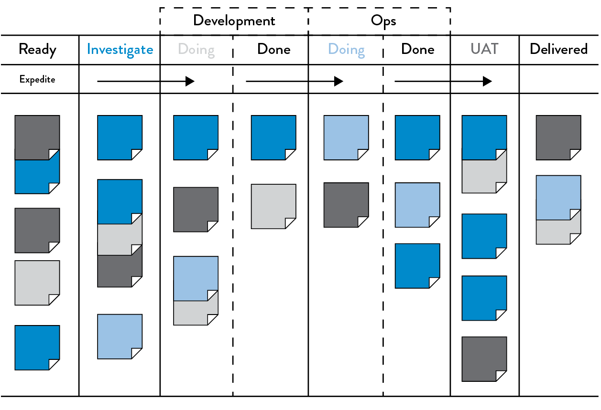
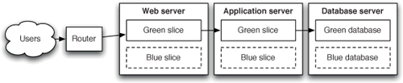
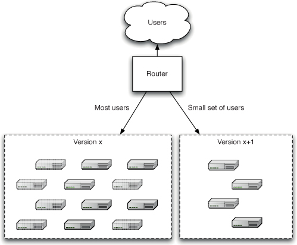

# DevOps

Source: The DevOps Handbook \(Gene Kim et. al\)

There is no one definition for DevOps. It's fundamentally about bridging the gap between Dev \(developers\) and Ops \(operations\), so that devs can do "ops" work and ops can write code \(like devs\) to automate/codify "ops" work.

DevOps is:

* a culture 
* a suite of tools
  * infrastructure as code
  * automated configuration management

## Some history

To understand why DevOps is awesome, we have to look at the history.

## Principles

The DevOps movement draws much of its inspiration from Lean Manufacturing \(sometimes known as "the Toyota Way"\). To enable fast and predictable lead times in any value stream, there is usually a relentless focus on:

* creating a smooth and even flow of work, 
* using techniques such as small batch sizes, 
* reducing work in process \(WIP\), 
* preventing rework to ensure we don’t pass defects to downstream work centers, and 
* constantly optimizing our system toward our global goals.

Here are some key DevOps principles:

* Make our work visible

  

* Limit work in progress \(WIP\)
* Reduce batch sizes
* Continually identify and elevate our constraints
  * In typical DevOps transformations, as we progress from deployment lead times measured in months or quarters to lead times measured in minutes, the constraint usually follows this progression:
    * Environment creation
    * Code deployment
    * Test setup and run
    * Overly tight architecture
* Eliminate hardships and waste in the value stream, such as:
  * Partially done work
  * Extra processes \(\)
  * Extra features \(e.g., “gold plating”\)
  * Task switching
  * Waiting
  * Motion \(The amount of effort to move information or materials from one work center to another\)
  * Defects
  * Nonstandard or manual work
  * Heroics \(e.g., 2:00 a.m. problems in production\)

## Practices

* Continuous integration
* Comprehensive testing strategy \(Automated testing + test pyramid\)
* Automated configuration management \(for infrastructure and environments\)
* Automated deployments \(and manual deployments to prod\)
  * The key to deploying any application in a reliable and consistent manner is constant practice
  * A “build and deployment expert” is an antipattern. Every member of the team should know how to deploy, and every member of the team should know how to maintain the deployment scripts.
* Release strategy

  * Blue-green deployments

  

  * Canary releases

  

* Technical practices of increasing feedback
  * Create telemetry to enable seeing and solving problems
  * Integrate hypothesis-driven development and A/B testing into our daily work
* Technical practices of continual learning and improvement \("kaizen" - 改善\)
  * Enable and inject learning into daily work
  * Convert local discoveries into global improvements \("find bugs once"\)
  * Reserve time to create organizational learning and improvement
    * Institutionalize routines/rituals to pay technical debt

## The DevOps toolchain

* Automated configuration management
  * Ansible
  * Chef
  * Puppet
  * Salt
* Automated provisioning
  * Terraform
  * \(some configuration management tools \(e.g. Ansible\) can also provision VMs\)  
* Continuous Integration
  * TravisCI
  * GoCD
  * Jenkins
  * Bamboo
  * TeamCity
* Containers
  * Docker
  * habitat.sh
* Secret management
  * Hashicorp Vault
* Monitoring
  * Sentry
  * New Relic
  * Datadog
  * Sensu
  * Splunk
  * Nagios

## Resources

### Recommended reading

* [The 12-factor application](https://12factor.net/)

### References

* [Continuous Delivery \(must read\)](https://www.amazon.com/Continuous-Delivery-Deployment-Automation-Addison-Wesley/dp/0321601912)
* [DevOps Handbook \(also must read\)](https://www.amazon.com/DevOps-Handbook-World-Class-Reliability-Organizations/dp/1942788002)

