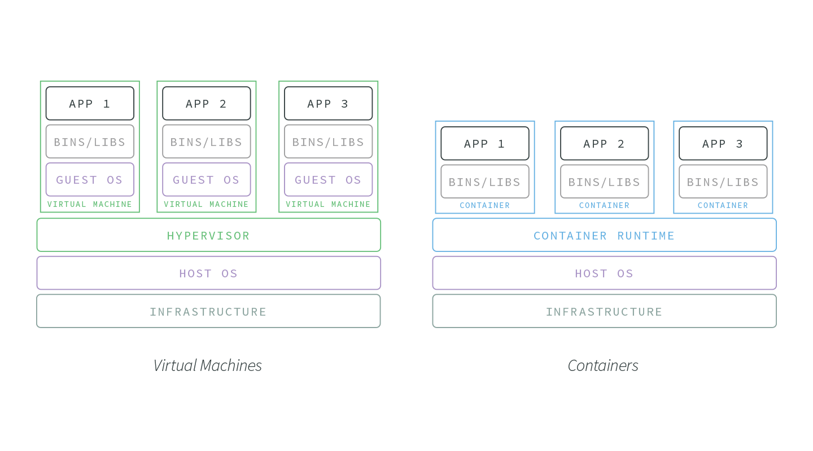

# Container Technology

Nowadays you can't call yourself as a developer if you haven't heard about Docker. Today, let's get our hands dirty and play with this cool piece of technology.

## Learning checklist

* What is a container?
* What is the difference between container and a traditional virtual machine?
* What are the benefits of container?
* How to install docker on your machine?
* What's a Dockerfile?
* What's a docker image?
* How to run an application distributed with a docker image?
* How to publish docker images to a docker image registry?
* How to run multiple images with docker-compose?
* What is kubernetes?

## What is a Container?

From [Docker website](https://www.docker.com/what-container)

> A container image is a lightweight, stand-alone, executable package of a piece of software that includes everything needed to run it: code, runtime, system tools, system libraries, settings.

From [Google Cloud Platform website](https://cloud.google.com/containers/)

> Containers offer a logical **packaging mechanism** in which applications can be **abstracted from the environment** in which they actually run. This decoupling allows container-based applications to be **deployed easily and consistently**, regardless of whether the target environment is a private data center, the public cloud, or even a developer’s personal laptop. Containerization provides a clean **separation of concerns**, as developers focus on their application logic and dependencies, while IT operations teams can focus on deployment and management without bothering with application details such as specific software versions and configurations specific to the app.

## What's the Difference between Container and Virtual Machines

The image below shows the difference between Virtual Machines and Containers \(credit: [NodeSource](https://nodesource.com/blog/containerizing-node-js-applications-with-docker)\)



Instead of virtualizing the hardware stack as with the virtual machines approach, containers virtualize at the operating system level, with multiple containers running atop the OS kernel directly. This means that containers are far more lightweight: they share the OS kernel, start much faster, and use a fraction of the memory compared to booting an entire OS.

## Benefits of Containers

For application development:

* Avoid installing 3rd party tools \(e.g. a MySQL database\) on your own computer
* Running multiple components of your system with `docker-compose`

For application deployment:

* Light-weight \(e.g. starting a new container image only takes a few seconds\)
* Consistent Environment. In each container, we bundle an application and its dependencies/runtime libraries into one image for distribution. Then this library does not depend on other environment configuration in the host machine \(where the container runtime runs\). We can run the same image in different environments \(QA/Staging/Production\)
* Cross Platform. A container can run anywhere as long as there is a container runtime on the target platform \(Windows/Mac/Linux\).
* Horizontal scalability \(you can start running new container images when you need more instances to share the workload\)
* Secure. The containers isolate each application process from other processes, even through they share the same host operating system.

## Containers and Images

A container is launched by running an image. An image is an executable package that includes everything needed to run an application--the code, a runtime, libraries, environment variables, and configuration files.

A container is a runtime instance of an image--what the image becomes in memory when executed \(that is, an image with state, or a user process\). You can see a list of your running containers with the command, docker ps, just as you would in Linux.

The docker images are built on top of each other. This allows us to reuse existing images.


## Installing Docker

[Docker](https://www.docker.com/what-docker) is the most popular container implementation on Linux at the moment.

Here is an [overview of docker](https://docs.docker.com/engine/docker-overview/#docker-architecture)

Follow the official instruction to install docker on your computer.

* [For Windows](https://docs.docker.com/docker-for-windows/)
* [For Mac](https://docs.docker.com/docker-for-mac/)

## About Dockerfile

As a developer, you create docker images by writing `Dockerfile`.

A Dockerfile is a text document that contains all the commands a user could call on the command line to assemble an image. One example is given below:

```text
FROM ubuntu
LABEL maintainer="yourname@example.com"
RUN apt-get update
RUN apt-get install -y nginx
ENTRYPOINT [“/usr/sbin/nginx”,”-g”,”daemon off;”]
EXPOSE 80
```

The Dockerfile above creates an image which installs Nginx \(a popular reverse-proxy server\) on top of Ubuntu. [This tutorial](https://rominirani.com/docker-tutorial-series-writing-a-dockerfile-ce5746617cd) explains the basics of Dockerfile content.

### FROM

A Dockerfile must start with a `FROM` instruction. The `FROM` instruction specifies the `Base Image` from which you are building.

### RUN

RUN has 2 forms:

* RUN  \(shell form, the command is run in a shell, which by default is `/bin/sh -c` on Linux or `cmd /S /C` on Windows\)
* RUN \["executable", "param1", "param2"\]. This is called `exec form`. This form makes it possible to avoid shell string munging, and to RUN commands using a base image that does not contain the specified shell executable.

Note: The `exec form` is parsed as a JSON array, which means that you must use double-quotes \(“\) around words instead of single-quotes \(‘\). It is also necessary to escape backslashes. This is particularly relevant on Windows where the backslash is the path separator. So the following line is wrong.

```text
RUN ["c:\windows\system32\tasklist.exe"]
```

The correct syntax for this example is:

```text
RUN ["c:\\windows\\system32\\tasklist.exe"]
```

The `RUN` instruction will execute any commands in a new layer on top of the current image and commit the results. The resulting committed image will be used for the next step in the Dockerfile.

### WORKDIR

The WORKDIR instruction sets the working directory for any RUN, CMD, ENTRYPOINT, COPY and ADD instructions that follow it in the Dockerfile

The WORKDIR instruction can be used multiple times in a Dockerfile. If a relative path is provided, it will be relative to the path of the previous WORKDIR instruction. For example:

```text
WORKDIR /a
WORKDIR b
WORKDIR c
RUN pwd
```

The output of the final pwd command in this Dockerfile would be /a/b/c.

### CMD

Unlike `RUN` \(which specify commands to build the image\), `CMD` does not execute anything at build time, but specifies the intended command for the image.

There should be only one `CMD` for each docker image \(because each docker image should only execute one process\). If you list more than one CMD then only the last CMD will take effect.

`CMD` can also be used to specify the arguments to the program specified in `ENTRYPOINT`.

The CMD instruction has three forms:

* CMD \["executable","param1","param2"\] \(exec form, this is the preferred form\)
* CMD \["param1","param2"\] \(as default parameters to `ENTRYPOINT`\)
* CMD command param1 param2 \(shell form\)

### ENTRYPOINT

An `ENTRYPOINT` allows you to configure a container that will run as an executable.

ENTRYPOINT has two forms:

* ENTRYPOINT \["executable", "param1", "param2"\] \(exec form, preferred\)
* ENTRYPOINT command param1 param2 \(shell form\)

What's the difference between `CMD` and `ENTRYPOINT`?

Both `CMD` and `ENTRYPOINT` instructions define what command gets executed when running a container. There are few rules that describe their co-operation.

* Dockerfile should specify at least one of CMD or ENTRYPOINT commands.
* ENTRYPOINT should be defined when using the container as an executable.
* CMD should be used as a way of defining default arguments for an ENTRYPOINT command or for executing an ad-hoc command in a container.
* CMD will be overridden when running the container with alternative arguments.

There is a nice [table](https://docs.docker.com/engine/reference/builder/#understand-how-cmd-and-entrypoint-interact) showing how `CMD` and `ENTRYPOINT` work together if both are specified.

### EXPOSE

The EXPOSE instruction informs Docker that the container listens on the specified network ports at runtime. You can specify whether the port listens on TCP or UDP, and the default is TCP if the protocol is not specified.

```text
EXPOSE 80/tcp
```

Note that the `EXPOSE` instruction does not actually publish the port. It functions as a type of **documentation** between the person who builds the image and the person who runs the container, about which ports are intended to be published. To actually publish the port when running the container, use the `-p` flag on docker run to publish and map one or more port.

e.g.

```text
docker run -p 80:80/tcp -p 80:80/udp ...
```

### ENV

The ENV instruction sets the environment variable  to the value . This value will be in the environment for all subsequent instructions in the build stage and can be referred in the subsequent instructions. The environment variables set using ENV will also persist when a container is run from the resulting image.

There are two forms:

```text
ENV <key> <value>
ENV <key1>=<value1> <key2>=<value2>...
```

The first form, ENV  , will set a single variable to a value. The entire string after the first space will be treated as the  - including whitespace characters.

The second form allows for multiple variables to be set at one time. Notice that the second form uses the equals sign \(=\) in the syntax, while the first form does not.

You can also set environment variables for a specific command with RUN, e.g.

```text
RUN <key>=<value> <command>
```

### ADD

The `ADD` instruction copies new files, directories or remote file URLs from  and adds them to the filesystem of the image at the path .

ADD has two forms:

* ADD \[--chown=:\] ... 
* ADD \[--chown=:\] \["",... ""\] \(this form is required for paths containing whitespace\)

Multiple `<src>` resources may be specified but if they are files or directories, their paths are interpreted as relative to the source of the context of the build.

The  is an absolute path, or a path relative to WORKDIR, into which the source will be copied inside the destination container.

e.g.

```text
ADD test relativeDir/          # adds "test" to `WORKDIR`/relativeDir/
ADD test /absoluteDir/         # adds "test" to /absoluteDir/
```

All new files and directories are created with a UID and GID of 0, unless the optional --chown flag specifies a given username, groupname, or UID/GID combination to request specific ownership of the content added. If a username or groupname is provided, the container’s root filesystem /etc/passwd and /etc/group files will be used to perform the translation from name to integer UID or GID respectively. The following examples show valid definitions for the --chown flag:

```text
ADD --chown=55:mygroup files* /somedir/
ADD --chown=bin files* /somedir/
ADD --chown=1 files* /somedir/
ADD --chown=10:11 files* /somedir/
```

### COPY

The `COPY` instruction is similar to `ADD`, which has two forms:

* COPY \[--chown=:\] ... 
* COPY \[--chown=:\] \["",... ""\] \(this form is required for paths containing whitespace\)

The major difference is that ADD can do more than COPY, e.g.

* ADD allows  to be an URL
* If the  parameter of ADD is an archive in a recognised compression format, it will be unpacked

The Best practices for writing Dockerfiles suggests using COPY where the magic of ADD is not required.

Note

* The instruction is not case-sensitive. However, convention is for them to be UPPERCASE to distinguish them from arguments more easily.
* The Docker daemon runs the instructions in the Dockerfile one-by-one, committing the result of each instruction to a new image if necessary, before finally outputting the ID of your new image.
* Each instruction is run independently, and causes a new image to be created - so RUN cd /tmp will not have any effect on the next instructions.

For more information on writing Dockerfile, read [official documentation](https://docs.docker.com/engine/reference/builder/) and the [best practices](https://docs.docker.com/develop/develop-images/dockerfile_best-practices/)

## Lab: get started with docker

You can follow [the tutorial at official docker website](https://docs.docker.com/get-started/) to learn the basics of docker.

## Lab: build a docker image for a node.js application

Following [this tutorial](https://nodejs.org/en/docs/guides/nodejs-docker-webapp/) to build a docker image for a node.js application.

More tutorials

* [https://buddy.works/guides/how-dockerize-node-application](https://buddy.works/guides/how-dockerize-node-application)
* [https://nodesource.com/blog/containerizing-node-js-applications-with-docker](https://nodesource.com/blog/containerizing-node-js-applications-with-docker)

## Lab: use docker-compose

[docker-compose](https://docs.docker.com/compose/) is a simple utility to run multiple images with one command

Following [this tutorial](https://nrempel.com/guides/docker-development-environment/) to try out docer-compose.

## Docker Hub / Docker Image Registry

[Docker Hub](https://hub.docker.com/) is a public docker image registry. You can publish your images to the registry and find useful images made by other people.

## Container Orchestration and Kubernetes

Once you get enough containers to manage, you need a tool to help you. [Kubernetes](https://kubernetes.io/) is the most popular solution for that purpose now.

Kubernetes Features

* Automated rollouts and roll backs
* Service health monitoring
* Automatic scaling of services
* Declarative management
* Deploy anywhere, including hybrid deployments \(e.g. across multiple cloud providers\)

## Lab on Kubernetes

For this lab, you need to [register an account on Google Cloud Platform](https://console.cloud.google.com/freetrial), which offers you $300 credits to try out the platform for one year.

Then you can follow this tutorial to learn the [basics of kubernetes](https://kubernetes.io/docs/tutorials/kubernetes-basics/).

Here is another good one: [Running the Node.js Bookshelf on Kubernetes Engine](https://cloud.google.com/nodejs/docs/tutorials/bookshelf-on-kubernetes-engine)

## Online Courses

* [Play with Docker](https://training.play-with-docker.com/)
* [Learn Docker Online](https://learndocker.online/)

## Resources

* [The Missing Introduction To Containerization](https://medium.com/faun/the-missing-introduction-to-containerization-de1fbb73efc5)
* [SystemAdmin Cast: Introduction to Docker](https://sysadmincasts.com/episodes/31-introduction-to-docker)
* [Intro to docker](https://towardsdatascience.com/how-docker-can-help-you-become-a-more-effective-data-scientist-7fc048ef91d5)
* [Docker and Kubernetes](https://hackernoon.com/the-best-architecture-with-docker-and-kubernetes-myth-or-reality-77b4f8f3804d)
* [Kubernetes? Docker? What is the difference?](https://blog.containership.io/k8svsdocker)
* [Docker best practices](https://github.com/FuriKuri/docker-best-practices)

