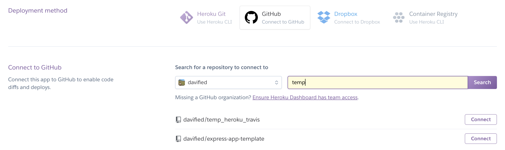
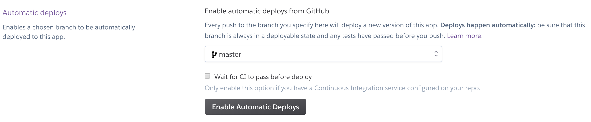

# Deployment to Heroku

To deploy your app to heroku, run the following steps:

- create a heroku application from the command line
```bash
# run this command if you're deploying create-react-app app
$ heroku create --buildpack https://github.com/mars/create-react-app-buildpack.git

# run this command if you're deploying any other app
$ heroku create
```

- Go to https://dashboard.heroku.com/ to complete the Heroku-Github integration
- Click on the project you created in the first step
- Click on Deploy tab → Deployment method → select GitHub

- Search for the repo of the application that you’re deploying → click Connect

- Further below, click on 'Enable Automatic Deploy'
- [Only for the first time deploying this app], click on “Deploy branch” at the end of the page


That's all! You can now visit the URL that's displayed in your console: [https://randomly-generated-name.herokuapp.com/](https://randomly-generated-name.herokuapp.com/). With every push to GitHub, your code is **automatically deployed** and accessible by anyone with internet access. Awesome!

## Resources

* [https://blog.heroku.com/deploying-react-with-zero-configuration](https://blog.heroku.com/deploying-react-with-zero-configuration)
* [`create-react-app-buildpack`](https://github.com/mars/create-react-app-buildpack) \(Browse the docs to understand what's going on and how you can add custom configuration\)