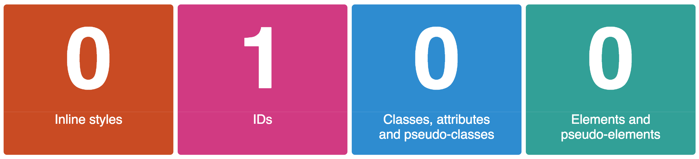

# Specificity Rules

Two or more competing rules might be applicable to a given element in one HTML page. And the rules may define different property values for the same element. In such cases, which should be applied?

CSS standard has defined three ways to resolve conflicts.

* Specificity rules
* Importance hint
* The order of rules when they are loaded by browser

## Specificity Rules

All css selectors are assigned a weight, and the heaviest selector takes precedence when conflicting CSS rules exist.

* Inline styles are worth 1,000 points;
* IDs are worth 100 points;
* classes are worth 10 points;
* elements are worth 1 point each. 

For example:

```css
p {
  /* 1 point */
}

p.chicken {
  /* 11 points */
}

p#fish {
  /* 101 points */
}
```

The selector with the highest points will win and its styles will override those of other selectors

You can visualise the formula to calculate specificity using the picture below:



## Overriding specificity scores with `!important`

People sometimes use `!important` to override the point system. This is an **anti-pattern** and you shouldn't do it. We only include it here because you might encounter it in your career.

```css
p#fish {
  background: black;
}

p {
  background: tomato !important; /* this style will be applied even though p#fish has a higher specificity score */
}
```

## The order of rules \(as when they are loaded by browser\) also matters

If a rule is defined after one with same specificity, the second rule wins:

For example,

```css
p {
  color: black;
}

p {
  color: white;
}
```

The rule that wins is `color: white`.

In general, the browser loads rules one by one, and the rules loaded later takes precedence over the rules loaded earlier \(when they have the same specificity\)

## Resources

* Specificity score calculator: [https://specificity.keegan.st/](https://specificity.keegan.st/)

