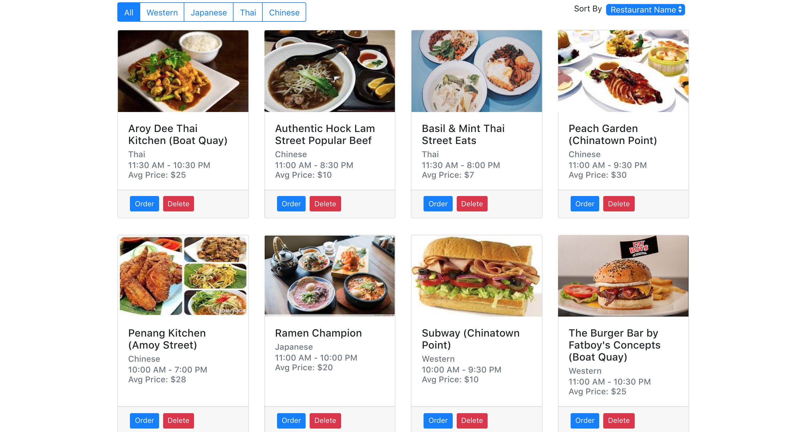
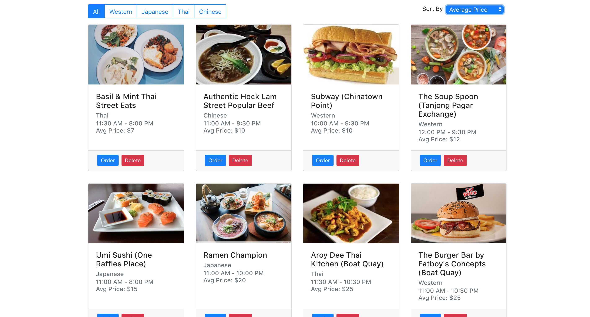
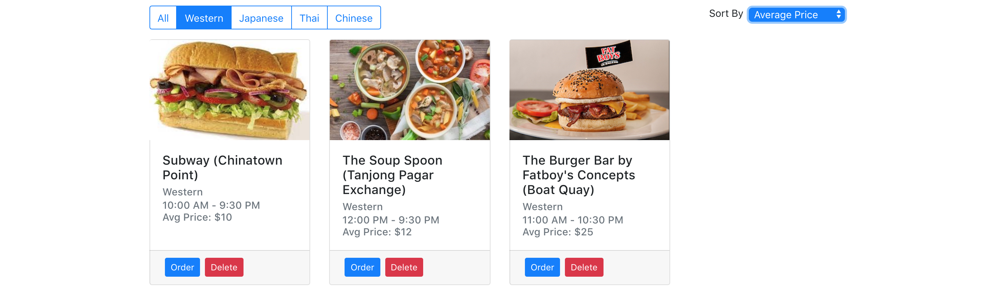

# Lab 3: Add a dropdown to sort restaurants by name or price

## Feature details

- In this lab you are required to build a dropdown that can sort the list of displayed restaurants by their name or price

- Navigate to the food-app project directory on your computer
- checkout to the lab 3 branch

```
  git checkout lab3
  git branch
```

- Create a SortBySelect component
- in src/components/SortBySelect/SortBySelect.jsx
- This component will be used by the HomePage component
- it will display 2 options

  - Restaurant Name
  - Average Price

- Create a handler in HomePage component to change the state when a dropdown option is selected

- By default the `Restaurant Name` option is selected the restaurant list is sorted in alphabetical order by name
- When the `Average Price` option is selected, the restaurant list is sorted in ascending order. (lowest price first)

## Expected Output

These screenshots are a sample of the expected output







## Hints

- Use the HTML [Select tag](https://www.w3schools.com/tags/tag_select.asp) to create the dropdown
- You can use the style `btn btn-primary` for the select component

## Solution

- After you have completed Lab 3, please commit all your work to the `lab3` branch

- You may optionally install the plugin **Git History Diff** for viewing the difference between git branches. This will allow you to easily compare your work with the sample solution

- [https://marketplace.visualstudio.com/items?itemName=huizhou.githd](https://marketplace.visualstudio.com/items?itemName=huizhou.githd)

- Next checkout to the solution branch and we will now walk through the sample solution

```text
git checkout lab4
```

- To view the difference between your work and the sample solution go to the VS Code file explorer, right click your folder and select `GitHD: View Folder Diff` and select compare with `lab3` branch

- The diff sidebar will popup and you can click on the files to view the difference between your work and the sample solution.

- When viewing the diff you can temporarily toggle the sidebar with `cmd + B` to hide it.

## Testing

- Next we will discuss how to test the feature with react testing library
