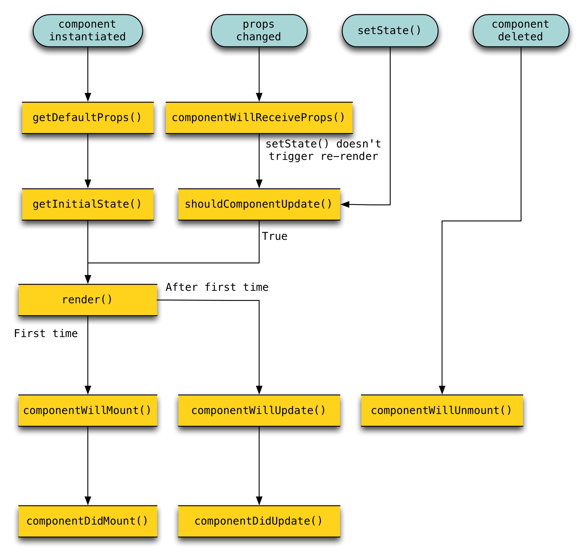

# Lifecycle hooks/methods

* Each component has 11 “lifecycle methods” which you can override to run your own code at particular times in the process.
* React's lifecycle hooks
  * **Mounting**: These methods are called when an instance of a component is being created and inserted into the DOM
    * `constructor()`
    * `componentWillMount()`
    * `render()`
    * `componentDidMount()`
  * **Updating**: An update can be caused by changes to props or state. These methods are called when a component is being re-rendered
    * `componentWillReceiveProps()`
    * `shouldComponentUpdate()`
    * `componentWillUpdate()`
    * `render()`
    * `componentDidUpdate()`
  * **Unmounting**: This method is called when a component is being removed from the DOM
    * `componentWillUnmount()`
  * **Error handling**: This method is called when there is an error during rendering, in a lifecycle method, or in the constructor of any child component
    * `componentDidCatch()`
* Methods prefixed with **will** are called right **before** something happens
* Methods prefixed with **did** are called right **after** something happens.
* 

