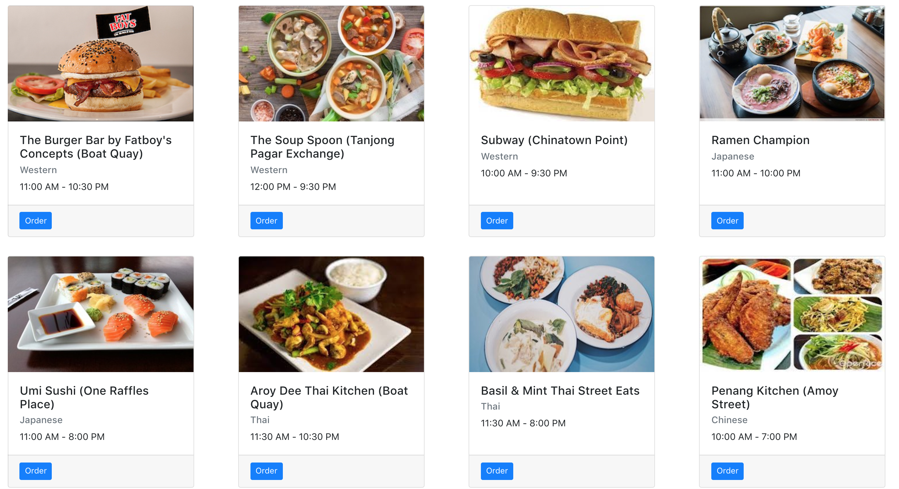

# Lab 1: List all restaurants from restaurant service

## Feature details

- In this lab you are required to render a list of 10 restaurants upon page load

- Navigate to the menu-app project directory on your computer
- checkout to the lab 1 branch

```
git checkout lab1
git branch
```

- Create 2 react components
  - HomePage
    - in src/components/HomePage/HomePage.jsx
    - this component will contain a list of Restaurant components
    - this component's state will store the list of restaurants
  - Restaurant
    - in src/components/Restaurant/Restaurant.jsx
    - this component will display the information of one restaurant

## Expected Output

This screenshot is a sample of the expected output after the page has loaded



## Hints

- The style is for the Restaurant component is a [bootstrap card](https://getbootstrap.com/docs/4.1/components/card/)
- you can access the restaurant data from RestaurantService `getRestaurants()`

## Discussion

- After the lab we will discuss the sample answer and how to test the feature with react-testing-library
