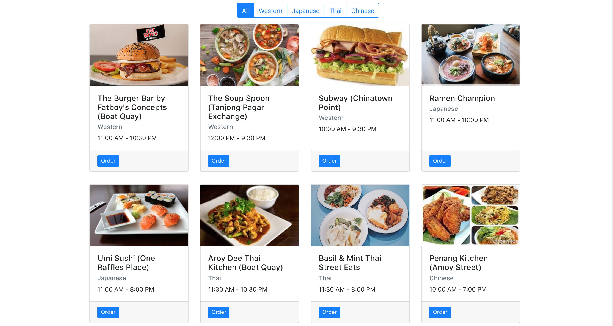

# Lab 2: Filter restaurants by cuisine

## Feature details
- In this lab you are required to build a FilterBar that can modify the displayed restaurants when the user selects a cuisine

- Navigate to the menu-app project directory on your computer
- checkout to the lab 2 branch
```
git checkout lab2
git branch
``` 

- Create a FilterBar component
- in src/components/FilterBar/FilterBar.jsx
- This component will be used by the HomePage component
- it will display 5 categories
  - All
  - Western
  - Japanese
  - Thai
  - Chinese

- Create a handler in HomePage component to change the state when a button on the FilterBar is clicked

- When the `All` button is clicked all restaurants are listed
- When the `Japanese` button is clicked, only Japanese restaurants are listed
  

## Expected Output
This screenshot is a sample of the expected output




## Hints
- The style is for the FilterBar component is a [bootstrap button group](https://getbootstrap.com/docs/4.1/components/button-group/) 
- be aware of binding `this` to the handler
- you will be required to pass a param to the handler

## Discussion
- After the lab we will discuss the sample answer and how to test the feature with react-testing-library