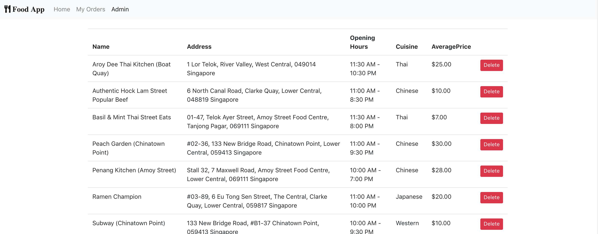

# Lab 5: Add a table to list and delete restaurants in the Admin page

In this lab you are required to create a table in the Admin page listing all restaurants

## Feature details

- Navigate to the menu-app project directory on your computer
- checkout to the lab 5 branch

```
git checkout lab5
git branch
```

- Create a RestaurantTable react component

  - in src/components/RestaurantTable/RestaurantTable.jsx
  - this component will list the restaurants in a table
  - and have a delete button for each restaurant
  - in the button event handler you can call `deleteRestaurant()` from RestaurantService to remove the restaurant from the list.
  - the listing should be in alphabetical order of the resstaurant name.

## Expected Output

This screenshot is a sample of the expected output



## Hints

- Use the [bootstrap table](https://getbootstrap.com/docs/4.1/content/tables/#examples) style

## Discussion

- After the lab we will discuss the sample answer and how to test the feature with react-testing-library
