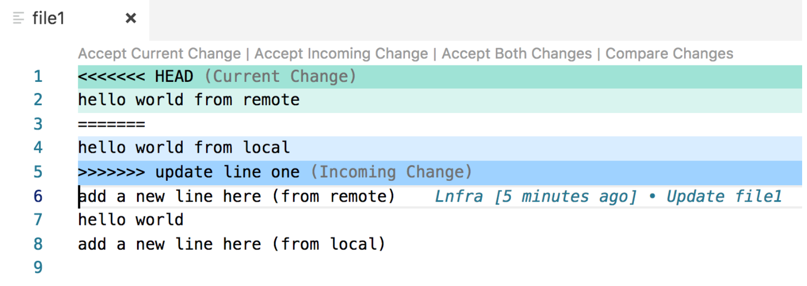

# Collaborating using Git

## Development Method 1: if you work on master

**How to merge to master**

1. Start from master 

0. Develop a new feature on master

0. git add and commit

0. git pull --rebase

0. Run all tests. If failing, fix the error, amend the commit and back to Step 4

0. git push

Note: if switching between different work stash your changes

## Development Method 2: if you use local branches

**How to merge to master**

1. Start on master do a git pull --rebase to get latest changes

0. git checkout -b new-branch

0. Develop a new feature on local branch

0. Periodically do `git pull --rebase origin master` this will get the latest changes from remote master and integrated it to your local branch

0. git add and commit 

0. `git pull --rebase origin master`

0. Run all tests. If failing, fix the error, amend the commit and back to Step 6

0. `git checkout master`

0. `git merge new-branch`

0. `git push`

0. `git branch -d new-branch`

## How to fix Merge conflict in VS Code

- Click on `Accept current change` to select the remote changes and delete your change 
- Click on `Accept incomming change` to select your changes and select the changes from remote
- Click on `Accept both` to select all changes and keep both
- Use Control + Z to undo if you selected the wrong choice

## Learning checklist

* Collaborating on git
  * steps for fixing merge conflicts
    * manually fix merge conflict
      * search for '=======' or '&gt;&gt;&gt;&gt;&gt;'
      * make a decision on what lines to keep, and what lines to delete 
    * `git add .`
    * `git rebase --continue`
    * If anything gets messed up during rebase, and you want to start over, run: `git rebase --abort`
* Making good commits
  * small commits
  * clear commit messages
* How to avoid merge conflicts
  * Pull/push frequently
  * Avoid editing the same files at the same time

## Lab

[https://github.com/thoughtworks-jumpstart/git-newsroom](https://github.com/thoughtworks-jumpstart/git-newsroom)
