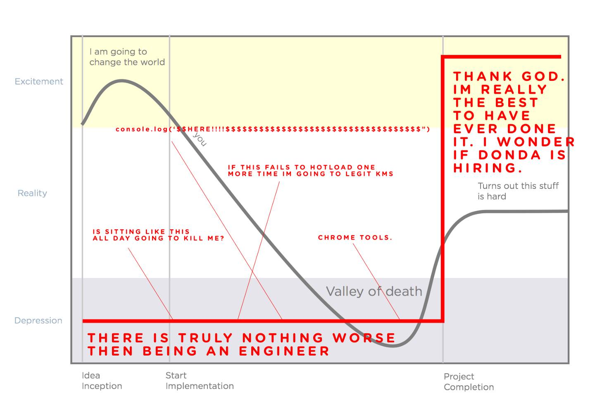
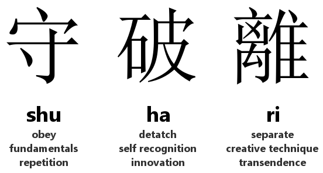

# How to learn effectively

One of the most important things we impart at JumpStart is effective learning. When you graduate, you will have a lifetime of learning, langauges, libraries, principles and tools ahead of you. The sooner we learn this, the better! \(Warning: This will be as challenging as it is rewarding\)

> "Education comes from within; you get it by struggle and effort and thought." \(Napoleon Hill\)
>
> "Education comes from the Latin word _educare_, which literally means 'led out,' in the sense of being drawn forth. I find that little tidbit really interesting, because we don’t generally think of education in that sense—of drawing forth something from the learner. Instead, it’s far more common to see education treated as something that’s done to the learner—as something that’s poured in, not drawn out. This model is especially popular in corporate training, with a technique that’s known as sheep dip training."
>
> A sheep dip \(for real\) is a large tank in which you dunk the unsuspecting sheep to clean them up and rid them of parasites \(see image below\). The sheep line up; you grab one and dunk in the tank for an intensive, alien, and largely toxic experience. It wears off, of course, so you have to dip them again.

## Learning checklist

* Technical advice
  * How to debug and read error messages
  * How \(not\) to google
  * anti-pattern: blind copy and paste
    * it's better to understand the solution to some degree than to just hack together some solution \(you'll save time in the long run\)
  * don't be afraid to break things in the dev environment. Change variable names, change code, watch it break. Experimentation is cheap. We can just git reset or undo changes.
  * ‎Words matter. Understanding even the simple words can go a long way in helping you understand a difficult concept. [Bust those jargons!](http://jargon.js.org/)
  * focus on essence and concepts, not the specific library's syntax or implementation
  * Read deliberately with **SQ3R**
    * **Survey**: Scan the table of contents and chapter summaries for an overview.
    * **Question**: Note any questions you have.
    * **Read**: Read in its entirety.
    * **Recite**: Summarize, take notes, and put in your own words.
    * **Review**: Reread, expand notes, and discuss with colleagues.
  * How to read the docs
    * use it like a dictionary. know the structure. know where to find things
    * find the API docs \(e.g. [MDN](https://developer.mozilla.org/en-US/docs/Web/JavaScript/Reference/Global_Objects) is great for Javascript\)
    * figure out what you want to do \(e.g. split a string into an array\)
    * zoom in to the right place in the docs \(e.g. [.split\(\)](https://developer.mozilla.org/en-US/docs/Web/JavaScript/Reference/Global_Objects/String/split)\) \(google is always helpful\)
    * Understand the method
      * what it does
      * what parameters it takes in
        * what should the parameters look like \(e.g. string, number, array, object, etc.?\)
        * which parameters are required / optional?
      * what the return value is
    * pause when confused
* Neurological advice
  * Reduce overhead
  * Take breaks
  * Practice, write code. Get it out of your head
  * Chunking
* Practical advice
  * Pair / explain it to a friend
  * Be comfortable with not knowing things. Call it out. Write it down as one of your todos. Acknowledging ignorance is the first step towards knowledge
  * Shuhari

    

  * Stay connected. Go to meetups. Meet awesome people. Listen to awesome ideas
    * [webuild.sg](https://webuild.sg) and [engineers.sg](https://engineers.sg) are great resources
    * subscribe to mailing lists \(e.g. nodeweekly, javascriptweekly, cronweekly, react status, DB weekly, etc\)
  * Less is more
    * Refrain from bookmarking / todo-listing tens and hundreds of articles of the same thing
    * it's better to eat one proper meal than to eat 10 of the same junk snacks
    * it's better to spend 1 hour training a routine deliberately than to spend 10 hours mindlessly whacking
* Learn enough to be dangerous
* Take it one step at a time \(try the improvement kata\) 

  > “Writing a novel is like driving a car at night. You can see only as far as your headlights, but you can make the whole trip that way.” - E.L. Doctorow

* Philosophical advice
  * Adopt a growth mindset
  * Embrace failure. There are two types of failure. There are the failures that are good for us that we can learn from. But there are failures that aren’t good for us. This second type of failure doesn’t produce any learning: it keeps us from learning in the first place, or it shuts down our learning in mid-experience.
  * **You**. The most important ingredient in the learning process is you. You have to want to learn. Somebody can give me essential guide to becoming an origami master, but if I don't want it, then it doesn't matter what was given to me

## Resources

* [Learning How to Learn](https://www.coursera.org/learn/learning-how-to-learn)
* [Stop saying coding is easy](https://www.hanselman.com/blog/StopSayingLearningToCodeIsEasy.aspx)
* [Teach yourself programming in 10 years](http://norvig.com/21-days.html)
* [What I learned about learning](https://medium.com/@davified/what-i-learned-in-2017-about-learning-d185f1f38772)
* [Carol Dweck - Growth Mindset](https://www.youtube.com/watch?v=hiiEeMN7vbQ)
* [How to teach yourself hard things](https://jvns.ca/blog/2018/09/01/learning-skills-you-can-practice/)
* [Myth of the Genius Programmer](https://www.youtube.com/watch?v=0SARbwvhupQ)
* [The genius fallacy](http://jxyzabc.blogspot.sg/2017/09/the-genius-fallacy.html)
* [Jargon.js](http://jargon.js.org/)
* [Javascript Masterclass](https://www.youtube.com/watch?v=v0TFmdO4ZP0) \(this talk is not about Javascript - rather it's about how to navigate the road to expertise/mastery\)

## Assignment

* [https://github.com/thoughtworks-jumpstart/moment-lab](https://github.com/thoughtworks-jumpstart/moment-lab)

