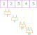

# reduce

## `.reduce()`

`.reduce()` takes in a callback function that can take in 3 positional parameters: `accumulator`, `element`, `index`

Syntax:

```javascript
const result = someArray.reduce(function(accumulator, element[, index, array]) {

}, accumulatorInitialValue)
```

[Check out the docs.](https://developer.mozilla.org/en-US/docs/Web/JavaScript/Reference/Global_Objects/Array/reduce)

**Example**: Calculating sum of an array of integers

```javascript
[1, 2, 3, 4, 5].reduce(function(accumulator, element, index) {
    console.log(accumulator, element, index);
    return accumulator + element;
});

// prints:
// 1 2 1
// 3 3 2
// 6 4 3
// 10 5 4
// returns 15

```

What's going on here? 

The best way to understand the process is to visualize it with a picture:



(credit: the image is taken from this blog entry: [understanding fold](https://sidburn.github.io/blog/2017/03/19/understanding-fold))

Now, let's change our focus on that `accumulator initial value`.

We didn't supply the initial accumulator value in the example above. In that case, the first element of the array (which is `1`) is used as the initial accumulator value and `2` is used as the first element to process.

We could supply the initial accumulator value explicitly, and we need to supply one that **makes sense**, depending on the operation we are doing. In this case, since we want to calculate the sum of the numbers in the array, we can supply the initial accumulator value as `0`.

For example, the code below would return the same result as the one above, but the initial accumulator value is set to `0`.

```javascript
[1, 2, 3, 4, 5].reduce(function(accumulator, element, index) {
    console.log(accumulator, element, index);
    return accumulator + element;
}, 0);

// prints:
// 0 1 0
// 1 2 1
// 3 3 2
// 6 4 3
// 10 5 4
// returns 15
```

Exercise: can you calculate the multiplication of numbers in the array with `reduce`?

**Example**: Reducing array of strings into one string

Not only can you accumulate numbers, you can also accumulate strings!

```javascript
const epic = ['a', 'long', 'time', 'ago', 'in a', 'galaxy', 'far far', 'away'];
const result = epic.reduce(function (accumulator, element) {
  return accumulator + ' ' + element;
}); // returns 'a long time ago in a galaxy far far away'
```

It may take a minute to get your mind wrapped around what's happening. However, by simply logging the values it \(hopefully!\) becomes much more clear what's going on.

```javascript
const result = epic.reduce(function (accumulator, element) {
  console.log('logging -- element: "' + element + '", ' + 'accumulator: "' + accumulator + '"');
  return accumulator + ' ' + element;
});

// logging -- element: "long",    accumulator: "a"
// logging -- element: "time",    accumulator: "a long"
// logging -- element: "ago",     accumulator: "a long time"
// logging -- element: "in a",    accumulator: "a long time ago"
// logging -- element: "galaxy",  accumulator: "a long time ago in a"
// logging -- element: "far far", accumulator: "a long time ago in a galaxy"
// logging -- element: "away",    accumulator: "a long time ago in a galaxy far far"
// >> 'a long time ago in a galaxy far far away'
```

**Example**: Changing the structure of an object

Example: We want to change up the structure of our users so that we can use the users' full name as the key and have their email as the value. Normally, this would take a lot of looping and initializing some variables. However, with reduce we can set an empty object as our starting point \(i.e. previous\) and do it all in a single go!

```javascript
const users = [{ fullName: 'George Washington', email: 'george@us.gov' },
             { fullName: 'John Adams', email: 'john@us.gov' },
             { fullName: 'Thomas Jefferson', email: 'thomas@us.gov' },
             { fullName: 'James Madison', email: 'james@us.gov' }];

const result = users.reduce(function (usersObj, user) {
  usersObj[user.fullName] = user.email;
  return usersObj;
}, {});

// { 'George Washington': 'george@us.gov',
//   'John Adams': 'john@us.gov',
//   'Thomas Jefferson': 'thomas@us.gov',
//   'James Madison': 'james@us.gov' }
```

## Resources

* [More about reduce](http://adripofjavascript.com/blog/drips/boiling-down-arrays-with-array-reduce.html)

