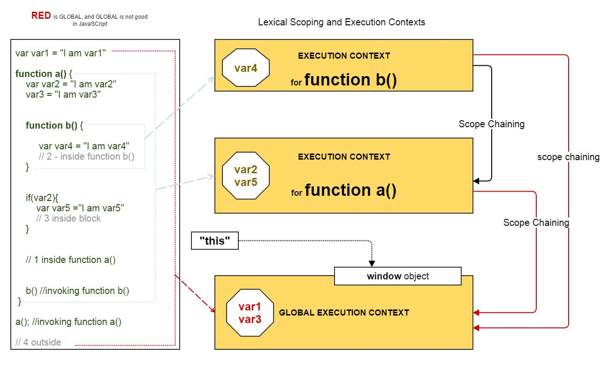

# More notes on the scope concept

## Variable Look-up process in JavaScript

Given the example below, what do you observe on the console?

```javascript
let a =1;

if (true) {
  let a = 3;
  console.log("value of a inside if-block", a) // this logs `3`
}

console.log("value of a outside if-block", a) // this logs `1`
```

Why does that happen? We need to understand how JavaScript engine finds the definition of a variable.

When a variable is referenced \(i.e. used\), the Javascript engine looks in its current scope \(e.g. if we're in a function, the Javascript engine will look inside the scope of the current function for the value of the variable\). If it cannot find the variable, it will **look up** to the next bigger scope \(e.g. global scope\).

Scope look-up stops once it finds the first match. The same identifier name can be specified at multiple layers of nested scope, which is called "shadowing" \(the inner identifier "shadows" the outer identifier\). Regardless of shadowing, scope look-up always starts at the innermost scope being executed at the time, and works its way outward/upward until the first match, and stops.

## Lexical scope rule

What we've described here is known as **lexical scoping**. Lexical scope means that scope is defined by author-time decisions of where functions are declared. The **lexing** phase of compilation is essentially able to know where and how all identifiers are declared, and thus predict how they will be looked-up during execution. Hence the name - lexical scope.

Another example is illustrated in the picture below:



(image source: https://www.java-success.com/q1-q5-javascript-interview-qa-on-variable-scopes-context/)

## `this` does not follow the lexical scope rule (except in arrow functions)

Unfortunately, when you try to deduce the meaning of `this` in JavaScript, you cannot follow this lexical scope rule except when this appear in arrow functions. 

In normal functions, `this` follows something like [dynamic scoping rule](https://github.com/getify/You-Dont-Know-JS/blob/master/scope%20%26%20closures/apA.md) which we will cover in an other section.