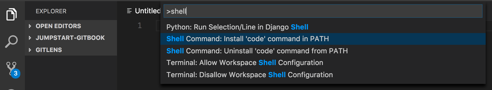

# Machine setup

Note: During this session, if you see any errors saying the program is already installed, check the version of the program \(by running `the_program -v` \(e.g. `node -v`\) or `the_program --version` and do one of the following:

* If the latest version is installed, you can skip the installation/upgrade step.
* Otherwise, you can upgrade the program to the latest version \(e.g. e.g. `brew upgrade node` or `choco upgrade nodejs`\)

## Common tools

### VS Code

We'll be using **Visual Studio Code** as our text editor of choice. You can download it from here: [https://code.visualstudio.com/](https://code.visualstudio.com/)

### Opening VS Code from your terminal / Git Bash

We often need to open VS Code to view all files in a directory. To do that, you need to add VS Code program to the `PATH` environment variable of your account.

Open a new shell terminal/Git Bash window, and type `code -v`. If your shell complains that code command is not found, do the following: 

1. Start VS Code 
2. Press F1 key. This will open a command palette window.
3. Type in the prompt: 'Shell' 
4. Select 'Shell Command: Install 'code' command in PATH 



After that, if you are in Mac terminal or Git Bash and you would like to view all the files in the current working directory with VS Code, you just need to type the following command 

```shell
code .
```

### Enable function keys by default in MacBook Pro with touch bar

If you are using a MacBookPro with touch bar (instead of function keys), you should configure the touch bar to display function keys by default when you open VS Code.

Following the [steps in this article](https://johnpapa.net/fntouchbar/) to enable the configuration.

### VS Code extensions

We have found the following VS Code extensions to be useful in improving our productivity. If you come across any other useful VS Code extensions, do share it with the class!

1. Start VS Code, 
2. Open the command palette \(Mac: `Cmd`+`Shift`+`P`; Windows: `Ctrl`+`Shift`+`P` or just press `F1`. 
3. Enter 'Install extensions'. 
4. Search for and install the following extensions one by one

* Javascript
  * [ESLint](https://marketplace.visualstudio.com/items?itemName=dbaeumer.vscode-eslint). This extension helps to check problems in your JavaScript codes.
  * [Prettier](https://marketplace.visualstudio.com/items?itemName=esbenp.prettier-vscode). This extension helps to format your JavaScript codes.
* HTML
  * [Auto Rename Tag](https://marketplace.visualstudio.com/items?itemName=formulahendry.auto-rename-tag). This extension makes it easy to rename HTML element tags.
  * [Auto Close Tag](https://marketplace.visualstudio.com/items?itemName=formulahendry.auto-close-tag). This extension automatically insert the other half of HTML tags.
  * [Live Server](https://marketplace.visualstudio.com/items?itemName=ritwickdey.LiveServer). This extension runs a HTTP server on your machine to view your HTML files.
  * [Browser Preview](https://marketplace.visualstudio.com/items?itemName=auchenberg.vscode-browser-preview). This extension embed a Chrome browser inside your code editor so that you can edit your HTML/JavaScript/CSS file and view the changes without leaving VS Code.
* Other Utilities
  * [advanced-new-file](https://marketplace.visualstudio.com/items?itemName=patbenatar.advanced-new-file). This extension makes it easier to create new files in your project directory.
  * [Path Intellisense](https://marketplace.visualstudio.com/items?itemName=christian-kohler.path-intellisense). This extension helps to autocomplete file path.
  * [Git Lens](https://marketplace.visualstudio.com/items?itemName=eamodio.gitlens). This is a powerful extension to work with git.

### Slack

We will be using slack to communicate throughout the course. If you haven't joined the channel, you can do so by clicking on this [link](https://join.slack.com/t/jumpstart-2/shared_invite/enQtMzYzODcwODMxNjA0LTkzOTA1M2UyNTRlNDZiNjdhY2I2OTk3NTU2NDI4YWM0NWJiZjYyMDUwMjEwYTg0YzNkZTRlYWE0NWU5ODE1YzA). You can login via the web browser, but we recommend downloading / installing the app.

[Download Slack](https://slack.com/downloads)

### Sign up for a GitHub  account

* Create a github account at [https://www.github.com/](https://www.github.com/)

## OS-specific tools

Continue your setup by selecting on your OS \(e.g. Mac / Windows\) on the left panel

