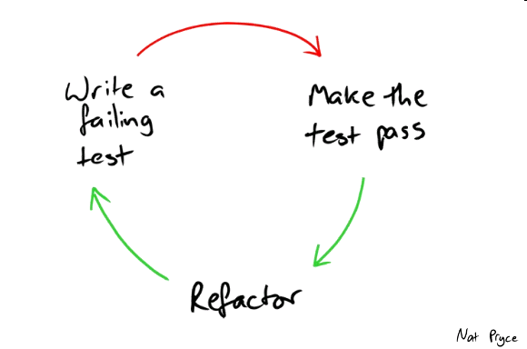

# TDD

## Learning checklist

* What is TDD / unit testing?
  * testing the smallest unit of code \(typically a function\)
* How to TDD
  * Write the test first before writing/changing the implementation \(code\)
  * Add the minimal amount of code required to pass the test
  * Repeat process until specifications for the function are fulfilled
  * Refactor
* Why TDD? 
  * any breaking changes are noticed immediately 
  * test harness lets us sleep at night 
  * a way of managing fear during programming/refactoring 
  * allow us to boldly refactor 
  * a useful process for incrementally solving design problems and partitioning complexity 
  * serves as living documentation for the codebase 
  * \(Read this page again at the end of the course and you'll see what we mean!\)
* Do the simplest thing \(a.k.a. 'baby steps', 'fake it till you make it'\). Once the test passes, add another test and write enough logic to pass that test.
* Red green factor 
  * Red: write a little test that doesn’t work, perhaps doesn’t even compile at first 
  * Green: make the test work quickly, committing whatever sins necessary in the process 
  * Refactor: eliminate all the duplication created in just getting the test to work
* Commit often
  * Each commit should be an atomic commit containing your implementation code **and** your test code
* Red red red red red revert
* Use simple/dummy data in tests. the functionality should not be coupled to actual production data \(doing so will increase your overhead and make TDD much much more difficult\)
* It may feel slower at first, but people working on the code will be able to move/pivot faster in the long term because of the test coverage
* Best practices for TDD
  * each test should ideally have a single assertion statement
  * don't refactor and implement new functionality at the same time
  * write 1 test case at a time
  * keep test cases simple
  * there should be no dependency among test cases
  * no connection to real/external dependencies \(e.g. HTTP service, database\)

## Resources

* [TDD By Example - \(read the preface at least!\)](https://www.eecs.yorku.ca/course_archive/2003-04/W/3311/sectionM/case_studies/money/KentBeck_TDD_byexample.pdf)
* [Using TDD to Influence Design](https://www.thoughtworks.com/insights/blog/using-tdd-influence-design)
* [Writing Testable Code](https://testing.googleblog.com/2008/08/by-miko-hevery-so-you-decided-to.html?m=1)

